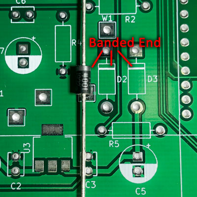
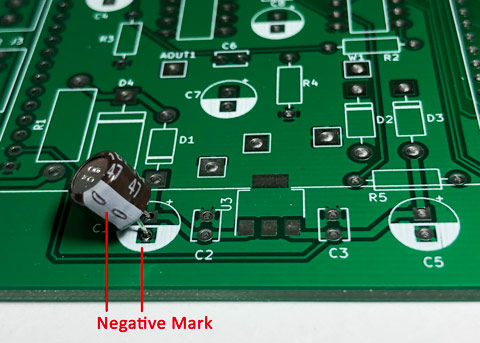
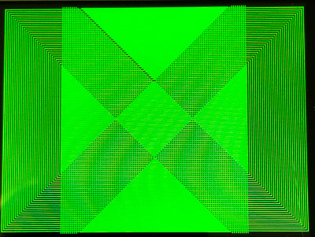
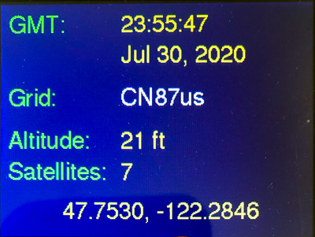

<h1>Griduino Kit Assembly Instructions</h1>

<h2>1. Introduction</h2>

Thank you for purchasing a Griduino GPS navigation kit. Once assembled, this kit is a useful driver's aid dedicated to show your location in the Maidenhead grid square system, your altitude, the exact time in GMT, barometric pressure and more.

These assembly instructions apply to Revision 4 of the printed circuit board.

<h2>2. You Will Need</h2>

You must have:

* **A soldering iron.** A standard fine tipped iron suitable for use with conventional 0.1” pitch through-hole components.  It is recommended that you use a temperature controlled iron at a suitable temperature for your solder, if you have one.
* **Decent quality solder, with a flux core.**  Any decent quality, thin, flux cored solder designed for electronic use should be suitable for assembling this kit. Solder size 0.50 mm is ideal. Do not use solder intended for plumbing.
* **Side cutters.** Once you have soldered the discrete components to the board, you will need to clip off the protruding wires. It is assumed that you will already have the necessary skills to solder this kit. If however you are not comfortable with through-hole electronic soldering, there are plenty of soldering tutorials available online.
* **Philips-head screwdriver.** There are four small screws to attach the PCB into the case.
* **Solderless breadboard.** To solder header pins onto small board assemblies, temporarily using a solderless breadboard will hold pins in correct alignment. 

It will be nice to have:

* **Hobbyist bench vise.** You'll need a way to hold the PCB at a convenient height and angle for soldering parts. A small adjustable bench vise, such as a Panavise Model 366, will make your task easier. This PCB is about 4-1/2" wide. 
 
 
* **Craft knife.** The plastic case will need small cutouts for power and speaker wires to reach the connectors. A very careful application of a sharp small knife can trim out the holes you need. A craft detail knife such as Fiskars 165110-1002 offers improved safety and precision. 

* **Blue painters tape.** While soldering things upside down, an easy-to-remove tape can temporarily hold parts onto the PCB. When you do this, solder only one pin, double-check the parts are still tight on the PCB. If not, reheat the one pin and press on the part to re-seat it tightly. Then solder the remaining lead(s).
* **Tiny flat head screwdriver.** If you use the 4-terminal strip after assembly (optional), it needs an unusually narrow-bladed screwdriver to reach the recessed screw heads.
* **Ohmmeter.** Use an ohmmeter or VOM (volt-ohm-milliameter) to measure resistors before installation to help guarantee you pick the right one for the right place.
* **Scosche Magnetic Mount** You'll want a way to mount this in your vehicle within easy view of the driver. Griduino can most likely be adapted to almost any popular cellphone mounting system. A particularly convenient and interchangeable system is the **Scosche Magic Mount** product line. It has a magnetic base mounted to the dashboard, and a ferrous plate stuck on the back of a Griduino or cellphone. https://www.scosche.com/
 
<h2>3. Identifying the Components</h2>

Some hardware such as the connectors and PCB should be easy to identify.

There are two 8-pin DIPs (dual inline pin) chips. Inspect the silkscreen label to identify which is which. Then look closely for a notch at one end -- this helps locate Pin 1. The notch must be oriented the same direction as the semicircle on the PCB.

Small diodes are marked with a band on one end for polarity; the band must be oriented the same direction as the band on the PCB. The large zener protection diode is not polarized and can be installed in either direction.

Electrolytic capacitors are marked with an arrow or "-" to indicate polarity. Also note the "minus" lead is shorter than the other lead. The PCB locations are marked with a filled semicircle (minus) and a small "+" symbol on the other side. When you install electrolytics, mount them flush on the PCB; this image has extra lead length to show the board markings.

<h2>4. Construction Step-By-Step</h2>

You should now be ready to build your Griduino. Here is a step-by-step progression through the assembly process in a recommended order. This order is not compulsory, however it has been chosen to ensure that smaller components are fitted before larger components that may make them difficult to reach for soldering. It is **strongly recommended** that you only unpack one component at a time: that which you are currently installing.

<h3>Step 1: U3 Voltage Regulator</h3>

Start with the small 3-terminal voltage regulator. This is not "through hole" so use a clothespin or surgical clamp or paper clip to hold it in place while soldering. The PCB is the heat sink so be sure to solder the big tab onto the board.

<h3>Step 2: Diodes</h3>

Three small diodes – careful of polarity; match the banded end (cathode) with board marking. In addition, the solder pad is square by the banded end.

<h3>*Step 3: Resistors</h3>

Measure the resistance of each resistor with your ohmmeter before installation. These items are very small and it's hard to read the color coded bands.

<h3>Step 4: Small 0.1 uF Capacitors</h3>

Four tiny 0.1 uF capacitors are all the same, but they're tiny so don't drop them. They are not polarized; however, it is good practice to orient their labels all in the same direction to make it easier to read their legends.

<h3>Step 5: Electrolytic Capacitors</h3>

Five electrolytic 47 uF capacitors - careful of polarity. The PCB is designed so they are all oriented and installed in the same direction. Don't use tall capacitors - although they're electrically equivalent, they won't fit under the display board above them.

<h3>Step 6: U1 and U4, 8-pin DIPS</h3>

The two 8-pin DIPs (dual inline package) are soldered directly to the board. It is recommended to avoid using a socket so that vibration does not make them work loose over time. The notch on the chip must be aligned with the semicircle printed on the PCB.

<h3>Step 7: U5 GPS Breakout Board</h3>

Put an 8-pin header into your solderless breadboard. Take another 8-pin header and remove all pins except one at each end; put this in your breadboard at a spot where the pins line up with holes on the GPS board. Solder the headers onto the GPS board. Remove it from the breadboard.

Do not solder a coin battery holder onto the back of the GPS. The GPS board must be tight against the PCB after it's installed on the PCB; a battery here would make it too tall. We have designed the PCB with a separate coin battery holder. 

<h3>Step 8: U2 Feather M4 Express</h3>

Test the Feather before using it. By testing first, we ensure it's usable before permanently installing it. To test it, plug a standard micro-USB cable into the Feather's onboard connector; the lights should show activity. If this is a new Feather, it comes with a factory program that flashes its red LED once per second in a sort of simple "hello world" program.

Take the two header pin strips and break them off to exactly match the Feather's pinout: one 12-pin strip, and one 16-pin strip. Temporarily put the strips into a solderless breadboard to hold them in precise alignment. Solder the Feather board to both header pin strips.

Insert the Feather board into the PCB and solder all the pins.

<h3>Step 9: U5 Ultimate GPS</h3>

Temporarily insert a 9-pin header strip into a solderless breadboard to hold them in correct alignment. Break off two single pins from a header strip and insert into the breadboard, aligning them with the two mounting holes on the opposite side of the GPS board. Lower the GPS onto the pins and solder them.

Remove the GPS from the breadboard and insert onto Griduino's PCB. Solder the assembly into place.

<h3>Step 10: BT1 Battery Holder</h3>

Solder the battery holder onto the PCB. This is a surface-mount device so use a small clamp or clothespin or tape to temporarily hold it in place while soldering.

Don't insert a battery just yet. Do this at the end to avoid any chance of shorts during construction.

<h3>Step 11: U7 Display ILI9341</h3>

First, solder jumpers IM1/IM2/IM3 on the back of the board. All you have to do is melt a fat solder bridge across each "jumper". The traces are close together to make this easier. This enables the SPI interface. Do not solder jumper IM0.

Next, insert one 20-pin header into a solderless breadboard; this will be the functional interface to the display board. Break off two 2-pin headers and insert them in the breadboard aligned with the outer holes on the opposite side of the display; this will be to physically support the display. Solder the display board onto the pins.

Place a 20-pin socket onto the pins on both ends of the display. The display board will hold the sockets in correct alignment for the next step.

Put the prepared display, including the two 20-pin sockets, onto the PCB. It will be spanning all the parts underneath. Turn the assembly upside down and rest the display on a soft non-scratch surface with the pins to be soldered facing up. Solder the sockets on to the board. 

When finished, gently unplug the display from its sockets for safekeeping while working on other parts. Insert the display again later when everything else is completed.

<h3>Step 12: Connectors</h3>

Lastly, install and solder the power connector, speaker jack and 4-pin terminal strip into place. Most of these connectors extend slightly beyond the edge of the PCB, so we install them lastly to avoid interfering with your bench vise hardware. Use 

<h3>Step 13: Plastic Case</h3>

*Bottom Half:* Screw the PCB onto the bottom half of the case. Use a craft detail knife to notch out a square hole for each of the three connectors (speaker, power, micro USB connector). The exact size will depend on your particular cable that you intend to use.

*Top Half:* There are at least three choices for the top cover.

* No cover – this is how I use my Griduino.
* Polycase cover – carefully cut an opening to fit the display. You'll have to come up with your own cutting template.
* 3D printed cover – The author has designed a top cover to fit the Polycase bottom half. The 3d design files are available upon request so you can print your own.

<h3>Step 14: Speaker</h3>

You can connect a small 8-ohm or 4-ohm speaker to the stereo plugin jack or to the screw terminal strip.

Note that both the speaker jack and speaker plug must be standard stereo connectors. (Do not use a mono plug: it will result in muted or very low volume.) However, this kit can only generate a single audio channel and it is connected to both sides of the stereo jack.

If you have a speaker wired to the 4-screw terminal strip, it will automatically be disconnected when you plug something in to the audio speaker jack.

For a good audio quality speaker and sufficient volume to fill a car and overcome road noise, Adafruit part number 3351 is recommended. This small speaker can be glued to the back of Griduino case. 

Note that increased audio volume is available when powering the Griduino from a car’s electrical system with 10-15 vdc, compared to powering it from the 5v USB connector.

<h2>5. Before You Use It</h2>

Snap a coin cell battery (3-volt CR1220 lithium) into the battery holder.

You should now have a completed Griduino GPS kit. Congratulations! 

Before you connect it to power, make a detailed visual inspection of it under a magnifier. Pay close attention to any solder bridges that may have formed between adjacent pads. Remove any surplus solder or solder bridges with desoldering braid. 

A visual check **very important** because any short circuits or solder bridges can damage the power supply, the battery, or the Feather M4. **If that happens it is your responsibility as the builder of the board.** It is better to have to rework or desolder something than to damage it. 

Visually check that the display is correctly plugged in to its two sockets. Look for isolated pins at each end that are not engaged in the socket. If it is accidentally mis-aligned onto the wrong pins, the power supply circuit is likely to be damaged. (Don't ask us how we know.)

<h2>6. First Power Up</h2>

Connect a micro-USB cable to the Feather M4 Express connector. If this is a factory-fresh Feather, you should see:

* Backlight turns on for the display
* Yellow LED flashes rapidly
* Red LED flashes once per second
* No text or graphics is shown on the display
* No audio is produced by the speaker

<h2>7. Programming the Griduino GPS</h2>

To load the Griduino programming onto your device, please refer to the open-source project on GitHub:

https://github.com/barry-ha/Griduino

Find the PROGRAMMING.md file for complete programming instructions.

The Griduino hardware platform offers a great deal of capability with a bright colorful display, powerful cpu, GPS receiver, barometric sensor, and a digital audio channel. We hope you invent fun and useful new things for it to do.

You may find the "examples" folder useful. It contains a variety of smaller programs that were used to develop certain concepts and check out features. 

<h2>8. Using the Griduino GPS</h2>

After loading and running the Griduino program, touch the top half of the screen to advance from one view to the next:

1. Power-up animation (one time only) 

2. Credits screen (one time only) 

3. Grid location view 

4. Grid details view 

5. GMT clock view 

6. Audio volume control 

7. Settings 

Touch the bottom half of the screen to adjust brightness levels.

Griduino has non-volatile storage to save your breadcrumb trail (driving track) from one day to the next. 

When you cross a grid line, the new grid is announced with CW on the speaker.

When you arrive at a destination, you can switch to the GMT clock view. This is useful to visually compare to your computer clock for accurate time.

<h2>9. Disclaimer</h2>

The information provided is for general education and entertainment. We hope you learn from this and enjoy your hobbies in a safe manner with this new GPS information available at a glance. We take no responsibility for your assembly and construction, nor for how you use these devices. In particular, **do not adjust Griduino while driving**. Keep your eyes on the road. We can not be held responsible for any property or medical damages caused by these projects. You are advised to check your local laws and consult professionals for any project involving electricity, construction or assembly. You are advised to drive in a safe and legal manner, consistent with all local laws, safety rules and good common sense.

You must accept that you and you alone are responsible for your safety and safety of others in any endeavor in which you engage. 
