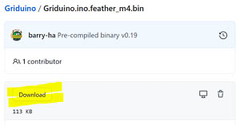

<h1>Griduino Programming Instructions</h1>

<h2>1. Introduction</h2>

Thank you for purchasing a Griduino GPS navigation kit. Now that you have it assembled, this document explains how to program it with the latest Griduino software. 

You can install a pre-compiled binary Griduino program, or configure the Arduino workbench to compile the source code yourself. Then you can compile our example programs or modify the Griduino program yourself.

Griduino is open-source: https://github.com/barry-ha/Griduino

When complete, you'll have a useful driver's aid dedicated to show your location in the Maidenhead grid square system, your altitude, the exact time in GMT, barometric pressure and more.

<h2>2. How to Install a Pre-Compiled Program on Griduino</h2>
Follow these steps to obtain the Griduino binary file and update the hardware.

1. **Download and Run Arduino IDE** 
The Arduino IDE (integrated development environment) is the main workbench for writing, compiling and testing Arduino programs. Visit www.arduino.cc and find the **Software Downloads** section. Scroll down to the **Download the Arduino IDE** section. Find and **run the installer** for your operating system. For Windows, it is normal for it to open the Microsoft Store and download over 200 MB. Follow the prompts to install the software. **Launch the Arduino IDE**. 
As of 8-7-2020, the latest workbench version is Arduino IDE v1.8.13

1. **Plug in Griduino** 
Use a standard USB cable to connect your Griduino hardware to your computer. Depending on your computer, you should see some message about "setting up device" and possibly "device Feather M4 is ready".

1. **Select Port** 
You'll need to figure out your COM port for this step. Here's how: 
On Windows, run the **Device Manager** and expand the section for **Ports**. One of the items listed under Ports represents the Griduino device. It is possible for the port assignment to change from day to day, so be prepared to return to the Device Manager as needed. 
In the Arduino IDE menu bar, go to **Tools > Port** and select the COM port that was given by the Device Manager. If there was more than one port listed, try them one by one.

1. **Install Board Support** 
In this step, we will install support files needed by Arduino IDE to talk to the Feather M4. Here's how: 
In the Arduino IDE menu bar, go to **Tools > Board > Boards Manager**. It will display a long list of hardware. Install the latest version of:
<ul>
<li>Arduino AVR Boards by Arduino: v1.8.3</li>
<li>Arduino SAMD Boards (32-bits ARM Cortex-M0+): v1.8.6</li>
</ul>

1. **Select Board** 
On the Arduino IDE menu bar, select **Tools > Board > Arduino SAMD (32-bits ARM Cortex-M0+ and Cortex-M4) > Adafruit Feather M4 Express** 
If the option is not available, please review previous step "Install Board Support".

1. **Download Griduino Binary**
You'll need a copy of the latest pre-compiled Griduino binary file. Here's how: 
Visit the GitHub repository at https://github.com/barry-ha/Griduino. Find and click on **Griduino.ino.feather_m4.bin**. This will open a new web page for the binary file alone. Find and click on the **Download** link. Save this file in a place where you can easily find it for the next step. 

1. **Install Griduino Binary on Feather M4 Express**
Now that the Arduino IDE is ready, and we have the binary file, here's how to download it to the Feather M4. 
<ul>
<li>Check that the Griduino hardware is still plugged in via USB to your computer.</li>
<li>Run Arduino IDE</li>
<li>On the menu bar, use **Tools > something (help!)**
</ul>

How to install without the IDE: https://forum.arduino.cc/index.php?topic=417659.0 

How to install with AVRDude: https://arduino.stackexchange.com/questions/20978/is-there-a-way-to-upload-precompiled-code-to-an-arduino 

More and sample cmd: https://forum.arduino.cc/index.php?topic=292979.0 such as "avrdude -c stk500v1 -P [com port] -p atmega328p -U flash:w:[Filename.hex]:i" 

My command line is: 
C:\Users\barry\Documents\ArduinoData\packages\arduino\tools\bossac\1.8.0-48-gb176eee/bossac -i -d --port=COM12 -U -i --offset=0x4000 -w -v C:\Users\barry\AppData\Local\Temp\arduino _ build _ 72645/Griduino.ino.bin -R

<h2>3. How to Setup the Arduino IDE for Griduino</h2>
If you want to compile Griduino source code or work with its example files (and we hope you do) then here's everything you need to setup the workbench.

(Coming soon)

<h2>4. How to Create a Binary File for Distribution</h2>

It may be useful to know how to create a binary image of a compiled program for Arduino processors in general. If you ever want to distribute an Arduino program, it is easier for people to install a binary image than to compile the source code themselves. 

This section also applies to how we create the Griduino program for general distribution.

1. **Launch Arduino IDE** 
Run the Arduino workbench on your computer.

1. **File > Open > Griduino.ino** 
Open the main source code file.

1. **Sketch > Export Compiled Binary** 
Wait for the compilation process to finish

2. **Sketch > Show Sketch Folder** 
You will find a binary file in the sketch folder with **.bin** extension. This is the compiled file which can be installed onto an Arduino board. e.g. “Griduino.ino.feather_m4.bin”

<h2>4. Disclaimer</h2>

The information provided is for general education and entertainment. We hope you learn from this and enjoy your hobbies in a safe manner with this new GPS information available at a glance. We take no responsibility for your assembly and construction, nor for how you use these devices. 

**Do not adjust Griduino while driving**. Keep your full attention on the road and the traffic around you. We can not be held responsible for any property or medical damages caused by these projects. You are advised to check your local laws and consult professionals for any project involving electricity, construction or assembly. You are advised to drive in a safe and legal manner, consistent with all local laws, safety rules and good common sense.

You must accept that you and you alone are responsible for your safety and safety of others in any endeavor in which you engage. 
