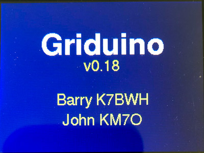
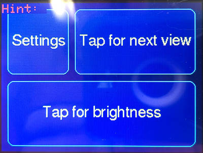
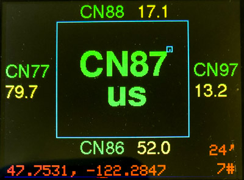
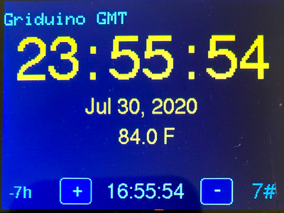
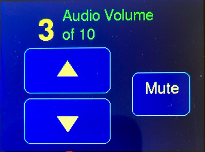

# Griduino
GPS display for vehicle dashboard showing position in the Maidenhead Locator System with distance to nearby grids. This is ideal for ham radio rovers.

# Introduction
Ham radio deals with invisible things.

We talk to invisible people. We look for contacts with invisible people that occupy invisible grid squares. To do so, we need to see invisible lines in the sky. I drive up mountains and travel on grid expeditions for VHF weak-signal operation. Being able to see these “invisible lines” is important to me. Seeing and hearing the unseen is always improved with technology (although I have that one uncle who doesn’t need any help /joke).

I want to know when I exit one grid square and enter another. Better yet, I want to know "how far to the next grid line in my current direction of travel?"

In contests I want time and distance figures to help me budget my time. I want to judge whether to stop and make contacts before leaving a grid. I want to get a sense of how long until I’m in the next grid. So, I’d like to know if a "new grid" opportunity is only a short distance away.

# Project Goals
For the operator:
1. How far to the next grid line?
1. What’s my current grid square?
1. Where am I in relation to the grid I’m occupying?
1. Where have I been? Or, how did I get here?
1. Make a bright display readable by a driver in motion.
1. What’s my altitude? Or, am I within a SOTA activation zone?
1. Hardware is powered from vehicle

For hobbyist developers:
1. Make a programmable platform easily adaptable to related projects
1. Publish the software as open source
1. Help the rover community build upon the platform.
1. Hardware should be possible for other hobbyists to duplicate
1. Hardware should small enough to mount conveniently on vehicle’s dashboard

# 	Griduino Usage
## Setup
Connect power: Griduino can be powered from two sources:
1. Connect USB to a computer for normal operation or programming, or
1. Attach 10- to 15-vdc source (automotive power) to the 5.5 mm barrel connector. The on-board regulator drops out at 9.8v. It seems to run okay with a 9v transistor battery for 30 minutes or more. 
The speaker is louder with automotive power than with USB power, because the audio amplifier uses whichever power source has higher voltage. 

Connect speaker:
1. Connect a small speaker to the 3.5 mm stereo jack.
It produces one-channel (mono) output. You can use a stereo speaker and both L and R output will have the same signal.

Place Griduino face up, preferably with a view of the sky to improve GPS satellite reception. The GPS receiver is very sensitive and will often work indoors.

## Operation
On power-up, Griduino shows credits (a splash screen) and plays Morse code callsigns of the authors.

Then it shows a Help screen to explain the touch-sensitive areas.
Touch Screen: There is a pressure-sensitive layer on top of the glass. We chose comically large touch regions so an operator can hit a target without looking.

- Top half:	Advance from one data screen to the next
- Bottom half:	Change brightness

Data Screens: Griduino v0.10 will display these screens.

1. Power-up animation (one time only) 

2. Credits screen (one time only) 

3. Help screen (one time only) 

4. Grid location view 

5. Grid details view 

6. GMT clock view 

7. Audio volume control 

8. Settings 

## Programming
Griduino project hardware and software is open source and available on Github: [github.com/barry-ha/](https://github.com/barry-ha/)

Griduino will have its own website at www.Griduino.com. (Not written yet, as of August 2020.)

## Arduino IDE Version
As of 8-5-2020, the build workbench is: **Arduino IDE v1.8.13**

Boards Manager: Install the latest version of these boards:

- Arduino AVR Boards by Arduino: v1.8.3
- Arduino SAMD Boards (32-bits ARM Cortex-M0+): v1.8.6
- Adafruit SAMD Boards: v1.5.11

Library Manager: Install the latest version of these libraries:

- AudioZero v1.1.1
- Bridge v1.7.0
- GSM v1.0.6
- LiquidCrystal v1.0.7
- SD v1.2.4
- TFT v1.0.6
- Adafruit BMP3XX Library v1.0.0
- Adafruit GFX Library v1.8.3
- Adafruit GPS Library 1.5.0
- Adafruit ILI9341 1.5.5
- Adafruit ImageReader Library 2.3.5
- Adafruit NeoPixel 1.5.0
- Adafruit SPIFlash 3.1.6
- Adafruit TouchScreen 1.1.0
- elapsedMillis by Paul Stoffregen 1.0.6
- SdFat – Adafruit Fork by Bill Greiman 1.2.3

This component is outside of  Arduino's Library Manager, so follow this link to GitHub and install the latest version:

- https://github.com/tom-dudman/DS1804 - library for DS1804 Digital Potentiometer

# Parts List
Griduino's main building blocks are:
1. Arduino Feather M4 Express - https://www.adafruit.com/product/3857 
1. Adafruit 3.2" TFT color LCD display ILI-9341 - https://www.adafruit.com/product/1743 
1. Adafruit Ultimate GPS - https://www.adafruit.com/product/746
1. Adafruit Barometric Sensor - https://www.adafruit.com/product/3966 
1. Speaker for voice or CW grid-crossings. The audio chain produces line-level output to a digital potentiometer DS1804 for volume control, and an LM386 audio amplifier to a built-in speaker.

# Disclaimer

The information provided is for general education and entertainment. We hope you learn from this and enjoy your hobbies in a safe manner with this new GPS information available at a glance. We take no responsibility for your assembly and construction, nor for how you use these devices. 

**Do not adjust Griduino while driving**. Keep your full attention on the road and the traffic around you. We can not be held responsible for any property or medical damages caused by these projects. You are advised to check your local laws and consult professionals for any project involving electricity, construction or assembly. You are advised to drive in a safe and legal manner, consistent with all local laws, safety rules and good common sense.

You must accept that you and you alone are responsible for your safety and safety of others in any endeavor in which you engage. 
