<h1>Griduino Kit Assembly Instructions</h1>

<h2>1. Introduction</h2>

Thank you for purchasing a Griduino GPS navigation kit. Once assembled, this kit is a useful driver's aid dedicated to show your location in the Maidenhead grid square system, your altitude, the exact time in GMT, barometric pressure and more. Further, the hardware is a highly capable platform for programming your own features.

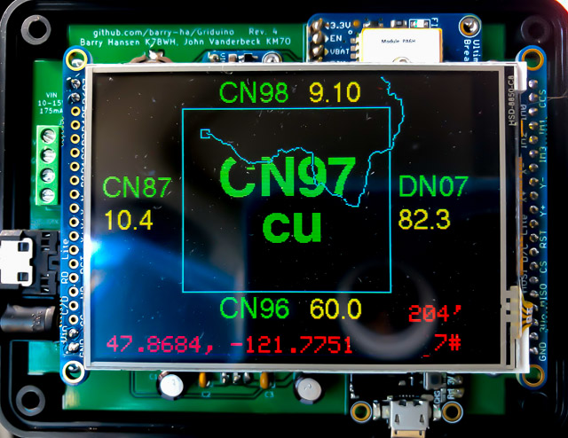

These assembly instructions apply to Revision 4 of the printed circuit board.

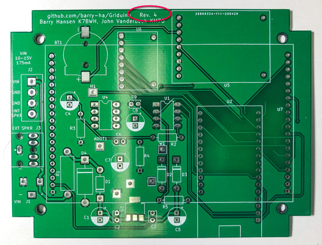

<h2>2. You Will Need</h2>

This kit is almost entirely "through hole" construction. Only two components, the battery holder and voltage regulator, are large surface-mount parts.

<h3>You must have:</h3>

* **Printed BOM and schematic diagram.** The component values are found on the bill of materials and the schematic. For example, to learn that R1 is a 22-ohm 2-watt resistor, you must find it in the BOM or schematic. These assembly instructions generally *don't* include part values in an attempt, possibly futile, to avoid multiple documents getting out of sync. The schematic is your ultimate golden master reference for all Griduino design. This is an open-source project and the latest documents are available on https://github.com/barry-ha/Griduino.

* **Fine-tipped soldering iron.** A standard fine-tipped iron suitable for use with conventional 0.1” pitch through-hole components.  It is recommended that you use a temperature controlled iron at a suitable temperature for your solder, if you have one. It is assumed that you will already have the necessary skills to solder this kit. If however you are not comfortable with through-hole electronic soldering, there are plenty of soldering tutorials available online.

* **Solder with a flux core.**  Any decent quality, thin, flux-cored solder for electronics will work. Solder diameter of 0.031" is good and 0.020" (0.50 mm) is better. Do not use solder intended for plumbing.  Some people like to use "no clean" solder but personally I've not had good luck it. We recommend something like Kester 245 63% Tin 37% Lead, part number [24-6337-0010](https://www.amazon.com/dp/B00068IJWC/ref=cm_sw_em_r_mt_dp_dfmcGb5707H9N). If the look of flux residue is bothersome, clean it with 91% isopropyl alcohol. Don't clean the _front_ of the PCB because alcohol can remove the silkscreen lettering. 

* **Needle nose pliers.** The component's leads must be bent with small pliers for a good fit into holes. Small pliers are also good for picking up the smallest parts from a tray.
* **Side cutters.** After you solder discrete components to the board, you will need to clip off the protruding wires. Wear eye protection and aim the bits away from you in a safe direction. 
* **Philips-head screwdriver.** Four small screws attach the PCB into the case. Four more screws attach the top cover to the bottom case.
* **Solderless breadboard.** A solderless breadboard will hold pins in exact alignment while soldering header pins onto small board assemblies. 
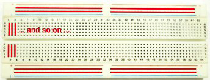

<h3>It will be nice to have:</h3>

* **Hobbyist bench vise.** You'll want a way to hold the PCB at a convenient height and angle for soldering parts. A small adjustable bench vise, such as a <a href="https://www.panavise.com/">Panavise Model 366</a>, will make your task easier. Use a holder wide enough to grip the Griduino PCB of 4-1/2" width. 
 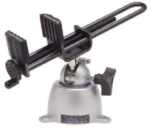
 
* **Craft knife.** The plastic case might need optional small cutouts to bring wires into the case, depending on how you choose to connect power and speakers. A careful application of a sharp knife can trim out notches or holes. A craft detail knife such as Fiskars 165110-1002 has better safety and precision than Exacto knives. 

* **Blue painters tape.** While soldering things upside down, an easy-to-remove tape is one way temporarily hold parts onto the PCB. When you do this, solder only one pin, then double-check the parts are still tight on the PCB. If not, reheat the one pin and press on the part to re-seat it. Then solder the remaining leads. 

* **Tiny flat head screwdriver.** If you use the 4-terminal strip after assembly (optional), it needs an unusually narrow-bladed screwdriver to reach the recessed screw heads. A "jeweler's screwdriver" will work well here.

* **Ohmmeter.** Use an ohmmeter or VOM (volt-ohm-milliameter) to measure resistors before installation to help ensure you have the right one in the right place.

* **Scosche Magnetic Mount.** Eventually you'll want a way to mount this in your vehicle within easy view. The Griduino case can most likely be adapted to almost any popular cellphone mounting system. A particularly convenient and interchangeable system is the **Scosche Magic Mount** product line. It has a magnetic base mounted to the dashboard, and a ferrous plate stuck on the back of a Griduino or cellphone. https://www.scosche.com/
 
<h2>3. Identifying the Components</h2>

Some of Griduino's hardware, such as the connectors and PCB, should be easy to identify. Every connector has a different footprint and will only fit one way.

To identify the two 8-pin DIPs (dual inline package), inspect the silkscreen label to identify which is which. Then look closely for a notch at one end -- this helps locate Pin 1. The chip's notch must be oriented the same direction as the PCB's semicircle.

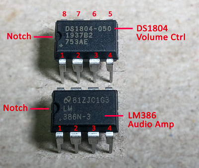

Small 1N4001 diodes are marked with a band on one end for polarity; the band must be oriented the same direction as the band on the PCB. 

The larger zener diode, D4, is a TVS protection diode (transient voltage suppressor) for clamping voltage spikes from exceeding +25 or -25 volts. It is bidirectional (not polarized) and can be installed in either orientation.

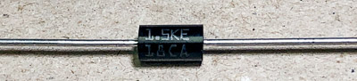

Electrolytic capacitors are marked with an arrow or "-" to indicate the negative polarity terminal. Also note the "minus" lead is shorter than the other lead. The PCB locations are marked with a filled semicircle (minus) and a small "+" symbol on the other side. When you install electrolytics, mount them flush on the PCB; the image below has extra lead length to show the board markings.

Header pins can join a small PCB onto the main board. They are designed to let you break off the number you need. Use needle nose pliers to hold steady the pins you'll keep and use your fingers to snap off the rest.

<h2>4. Construction Step-By-Step</h2>

You should now be ready to build your Griduino. We recommend this step-by-step progression through the assembly process, chosen to install the smaller components before the larger components which makes them easier to solder into place. We recommend that you only unpack one component at a time: that which you are currently installing.

<h3>Step 1: U3 Voltage Regulator</h3>

Start with the small 3-terminal voltage regulator. This is surface-mounted and not a "through hole" component so use a clothespin or surgical clamp or paper clip or anything but your finger to hold it in place while soldering. 

Solder one pin to the board. Remove your clamp. Solder the remaining pins. 

<h3>Step 2: Diodes</h3>

Insert the three small 1N4001 diodes, D1 - D3, being careful of polarity; match the banded end (cathode) with the board marking. The board also indicates the banded end with a square solder pad. It is good practice to bend its wires in such a way that its marking "4001" is on top and readable.

Attention: Diode D1 on the PCB is turned in the opposite direction of D2 and D3.

Solder the three diodes into place and snip off excess wire lengths.

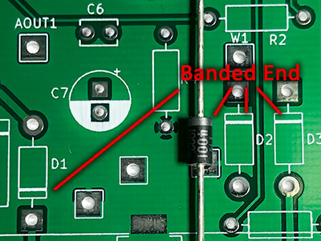

Insert the larger TVS diode, D4, and solder into place. Although the board marking shows its location with a banded end, this diode is bidirectional and can go either way.

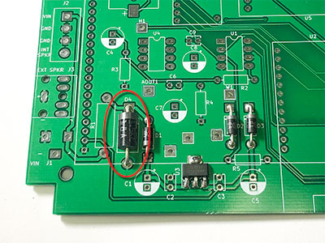

Automobiles are "the power supply from hell." The TVS diode protects the Griduino from wild voltage spikes in either direction. 

<h3>Step 3: Resistors</h3>

This kit uses five resistors, R1 - R5, each of a different value. Refer to the [bill-of-materials](https://github.com/barry-ha/Griduino/blob/master/hardware/bill_of_materials.md#passive-components "BOM") or schematic for the values.

Measure the resistance of each item with your ohmmeter before installation. These resistors are very small and it's easy to mistake the color coded bands.

Insert resistor R1 - R5 onto the PCB. It is good practice to orient the color code bands in the same direction; this makes them easier to read.

Solder the five resistors and snip off excess wire lengths.

<h3>Step 4: Small 0.1 uF Capacitors</h3>

The four tiny 0.1 uF ceramic capacitors are all the same, but they're tiny so don't drop them. They are not polarized; however, it is good practice to orient their labels all in the same direction to make it easier to read their legends.

Solder the four small ceramic capacitors onto the PCB and snip off excess wire length.

<h3>Step 5: Electrolytic Capacitors</h3>

This kit has five identical 47 uF electrolytic capacitors. Be careful of polarity; incorrect installation can cause them to burst and leak acid. The PCB is designed so they are all installed in the same orientation. 

Don't substitute taller capacitors - although they would be electrically equivalent, they won't fit under the display board above them.

If your electrolytic capacitors are taped onto a strip, as in for automatic insertion machines, then clip the leads off the strip. This is the easiest way to free the capacitor. Otherwise the tape's residue may stick to the wires and interfere with assembly.

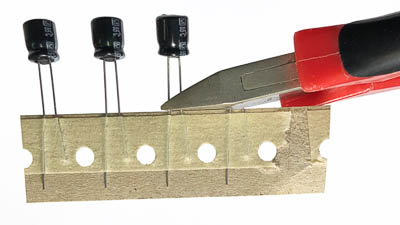

Solder only one lead of each electrolytic. Then check that the capacitor is flush with the board. If not, reheat the wire while pushing it down. Then solder the other lead. Snip off excess wire.

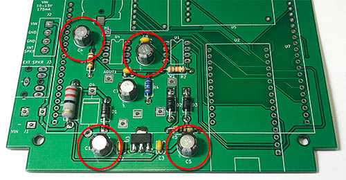 

<h3>Step 6: U1 Volume DS1804 and U4 Audio LM386, 8-pin DIPS</h3>

The two 8-pin DIPs (dual inline package) are soldered directly to the board. It is recommended to *not* use a socket so that vibration cannot cause them work loose over time. The notch on the chip must be aligned with the matching semicircle printed on the PCB.

Note: pins on the DIP are slightly wider than the PCB hole spacing. They are designed this way for pick-and-place machines that squeeze DIPS during assembly. You may find it helpful to manually compress the pins together ever so slightly before inserting into the board. Be gentle; if you press too hard the chip flips over and gently inserts its pins deep into your thumb. 

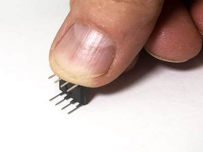

Insert U1 Digital Potentiometer DS1804 and U4 Audio Amplifier LM386 into the PCB. Make sure each chip's notch is oriented to match the board's silkscreen. You may want to tack-solder a single pin from the top to hold the chip in place, before turning over the board to solder all the pins from the bottom.

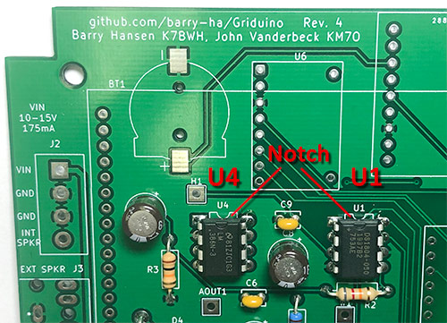

<h3>Step 7: Test Points</h3>

Griduino has 6 optional test points. Three grounding points are together near the voltage regulator and the other three are in the audio chain for checking sound levels and linearity. See the schematic for details. Test points are intended to attach an oscilloscope during software development and are not normally used.

The test points are sized to wedge into their holes up to their shoulders, holding themselves in place while you turn the board upside down and solder them.

Some people say the test points are easier to solder from the top side if you have a good fine-tip soldering iron.

<h3>Step 8: Testing Feather M4 Express</h3>

Test the Feather before using it. By testing first, we ensure it's functional before permanently installing it. After soldering it in place, it will be very difficult to remove. 

To test a Feather, plug a standard micro-USB cable into the onboard connector; the lights should show activity. 

* If this is a new Feather, it comes with a factory program that blinks the NeoPixel LED in *green* as a simple "hello world" program.  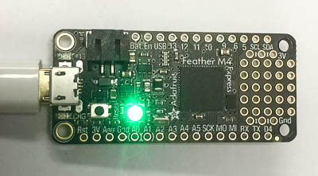

* If this is *not* a new Feather, you can replace its programming. Get the [Blinky](https://learn.adafruit.com/adafruit-arduino-lesson-2-leds/blinking-the-led) demo program to blink the *red* LED, then compile and install the program using the Arduino workbench.  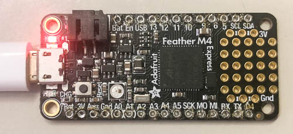

<h3>Step 9: Installing Feather M4 Express</h3>

The Feather comes with two 16-pin header strips loose in the package. Take one 16-pin strip and break off 4 pins so it exactly matches the Feather's pinout: one 12-pin strip, and one 16-pin strip. 

Put the header strips into the PCB; this ensures precise alignment. The long end of the pins go down into the breadboard; the short end goes into the Feather's PCB. (Actually the long pins can go up *or* down, it doesn't matter. We like them down for a more tidy appearance from the top.)

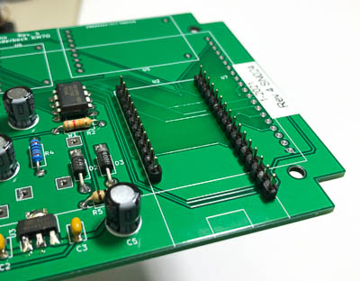

Put the Feather board onto the header strips. 

Solder the top pins only.

Make sure the pins are completely inserted and the Feather is held off the PCB by only the small black part of the header strip.

<h3 style="color:darkred">Wrong:</h3>

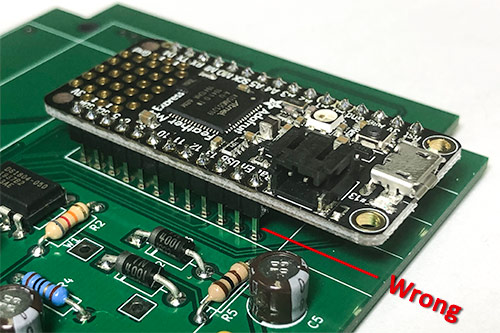

<h3 style="color:green">Correct:</h3>

Solder one bottom pin to the PCB. Check again the header strips remained flush against the board. Solder the remaining pins.

You don't need to clip off the long ends; there is ample room inside the case.

It's a good idea to test the Feather once again with the Blinky program. 

If the Feather's LED doesn't blink as expected, don't panic; sometimes the computer acquires the Feather M4 as an external drive identified as CIRCUIT.PY or FEATHERBOOT. Check the computer's list of drives to see if that's the case. Unplug and reconnect the Feather several times until it blinks its light.

<h3>Step 10: Barometric Pressure Sensor</h3>

The barometric sensor comes with a matching 8-pin header strip. Insert this header strip into the main board, long pins first and short pins extending upward. (Okay, it doesn't really matter but we think this looks better.)

If you have a **BMP-388**, break off two single pins from a leftover strip and insert them into the other two corners. The two single pins in the corners are for physical support and have no other functional purpose. Do not solder them yet.

If you have a **BMP-390**, do not insert two single-pin supports. The BMP-390 breakout board is pin-compatible but a different size and the support holes don't line up.

Lower the barometric sensor mini-board onto the pins and solder the top pins. 

If needed, clamp or tape the pressure sensor in place, and turn over the assembly and solder one pin on the end of the strip on the bottom of the board. 

Check the assembly is still tight to the board. If not, reheat the pin while pushing the assembly tight to the board. Solder the remaining bottom pins, and solder any remaining top pins.

<h3>Step 11: BT1 Battery Holder</h3>

Solder the battery holder onto the PCB. This is a surface-mount device; note that it has a small plastic detent to precisely align it in place. You might still need a small clamp or clothespin (remember those?) or tape to temporarily hold it in place while soldering. 

**Do not** insert a battery yet. Put the battery aside until the end to avoid any chance of shorts during construction. In fact, the battery is optional. Its only purpose is to maintain the RTC (real time clock) while Griduino is turned off, thereby reducing the wait-time for GPS synch.

<h3>Step 12: U5 Ultimate GPS</h3>

The "Ultimate GPS" package shipped from Adafruit comes with a header strip and a battery holder.

* Count the pins on the supplied header strip. The GPS requires a 9-pin header and sometimes Adafruit may ship an 8-pin header. If needed, add an extra pin from some extra strip, such as the one leftover from the Feather.
* Do not solder a battery holder onto the back of the GPS. It won't hurt anything to have this holder, but it will go unused. Its slot will be unreachable after all the parts are installed. Instead, our Griduino board is designed with a separate coin battery holder, BT1, to replace the one on the Ultimate GPS board.

Insert a 9-pin header pin strip onto the Griduino PCB. Break off two single pins from a leftover strip and insert them into the other two corners. Do not solder them yet. Also shown below are the two battery holders and which one goes on the board in the next step.

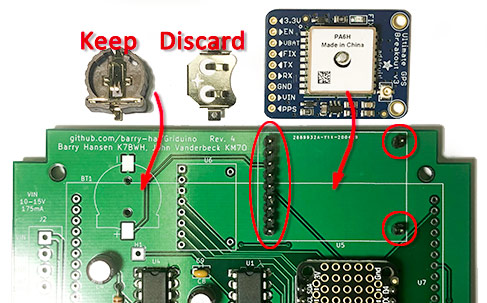

Lower the GPS onto the pins and solder the top pins. The two single pins in the corners only provide physical support and have no other functional purpose.

Tape the GPS assembly in place, if needed. Turn the board over and solder one pin. Check the GPS assembly is still tight to the board. If not, reheat the pin while pushing it down. Solder the remaining pins.

<h3>Step 13: U7 Display ILI9341</h3>

First, solder jumpers IM1/IM2/IM3 on the back of the board. Melt a solder bridge across each "jumper". The traces are close together to make this easier. This enables the SPI interface. Do not solder jumper IM0.

Turn the display-side up. Note the orientation of the 3.2" TFT display board is important:

* The two **GND pins** must go nearest to the USB connector. 
* The corner with **CD and CCS pins must go nearest to the GPS**; this is the SPI interface that Griduino uses. The other side with pins D0-D7 is the parallel port which is unused.

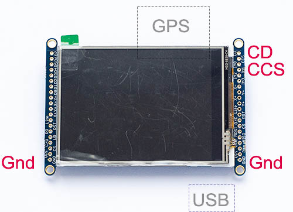

**Warning:** Always insert the display in this orientation. The circuit will be damaged if you reverse it. Don't ask me how I know.

To help make the proper orientation obvious, we will mount different connectors on each side.

These steps will solder the fragile pins onto the PCB, and the sturdier sockets onto the display board. This makes it easier to set the display aside without bending pins or stabbing defenseless fingers.

Assemble the display parts on the main board, which will hold everything in correct alignment before soldering:

1. Start with main Griduino PCB
1. Insert one 20-pin header on the PCB to the right of the Feather, **long pins facing up**.
1. Insert two 2-pin headers on the PCB along the left edge, one at each end of the row of 20 holes, **long pins facing up**. These will physically support the display. 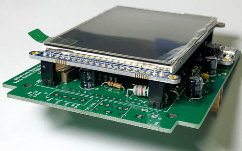 
1. Insert one 20-pin socket on the display, matching the 20-pin header.
1. Insert two 2-pin sockets on the display, matching the 2-pin headers on the PCB.
1. Lower the display board onto the pins, spanning all the parts underneath.
1. Check pin alignment and orientation of the display. 

Before you solder, gently wiggle the display to feel where the assembly is centered with the least stress and tension. This is the exact spot that will ultimately center the display into the cutout window of the plastic case. It will save work later to center the display onto the PCB as well as possible.

From the top, solder one pin on the display. It will start to feel more firmly mounted and you can check the alignment. When you like the position, solder one more pin and check again.

From the top, solder all pins on the display board.

Turn it over, holding the assembly together, and rest the display on a soft surface. Solder all socket pins on the bottom of the main board.

Hey, want to check your work? At this point of assembly, you can plug in USB power: The Blinky program will flash the red LED and the backlight will turn on. You can even load the Griduino program and it will basically work fine except it lacks its connectors to the world.

Turn the assembly right side up and gently unplug the display from the sockets for safekeeping while working on other parts. Later, when everything else is completed, the display will be inserted again.

<h3>Step 14: Connectors</h3>

Lastly, insert and solder the power connector, speaker jack and 4-pin terminal strip into place. Be sure to orient the terminal strip so its **openings go toward the edge**. Most of these connectors extend slightly beyond the edge of the PCB, so they are installed after everything else to avoid interfering with your bench vise hardware.

<h3>Step 15: Bottom Half of Plastic Case</h3>

The Griduino kit comes with  a plastic enclosure from <a href="https://www.polycase.com/">Polycase</a> in their QS-50 Series that exactly matches the PCB mounting holes. Other enclosures could probably be used. If you choose something else, avoid metallic cases since they would block the microwave GPS signal and would need an external antenna.

Temporarily position the PCB in bottom half of the Polycase enclosure. Check for interference and, if needed, use a craft detail knife to notch out holes for each of the three connectors (speaker, power, USB connector). The exact size depends on your particular cable that you choose to use.  For sake of sizing the USB hole, find a USB cable that has the largest connector available.

Screw the PCB onto the case's mounting posts, watching the speaker and power jacks clearance. You may need to carve a little extra room in the cutouts, even with the custom-milled case, depending on how the jacks were soldered onto the board.

Don't overtighten the PCB screws. These are short, small screws and can be easily stripped.

**Optional:** You can buy an active external antenna for this GPS from other vendors. The GPS has a "uFL" connector so be aware that you may need an [SMA to uFL RF Adapter Cable]([https://www.adafruit.com/product/851), depending on your choice of antenna.

**Optional:** If you'd like to run wires (e.g. power or speaker) through the back of the case, then drill a 3/8" hole (9 mm) at the position the mark in the mold as shown in the photo below.

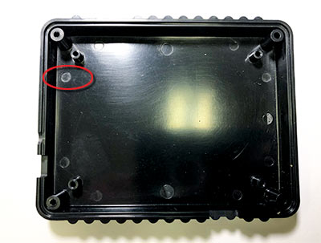

There is just enough room for a few thin wires to fit between the PCB and the case, allowing them to exit through your drilled hole. Here's an example of power wires escaping out the back for an Anderson Powerpole connector to the shack's power supply.

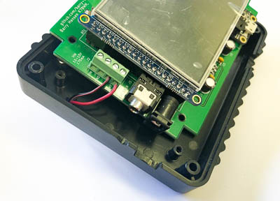

**Optional:** The Griduino kit includes four optional nylon #6 washers that can go under the mounting posts as a standoff. Put these aside for later. They can help close a possible gap between the display and top cover surface.

<h3>Step 16: Top Half of Plastic Case</h3>
There are several choices for the top cover. Choose one of these according to your desires and what you have available.

<h3>16.a No cover</h3>
This is how I use my Griduino. This is the easiest way to reach the Reset button during software development or to double-click the Reset button to apply pre-compiled software updates. 

<h3>16.b Polycase standard cover</h3>
If you have the unmodified [Polycase QS50](https://www.polycase.com/qs-50), carefully cut an opening to fit the display. A [manual cutting template](https://github.com/barry-ha/Griduino/tree/master/hardware) is available that can be printed and taped on for guidance.  Cutting the top cover's opening by hand is actually rather difficult to do accurately and neatly.

Carefully cut openings for the connectors and display with a sharp craft knife.

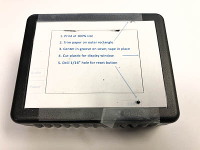

<h3>16.c Polycase custom-milled cover</h3>
This is the easiest approach to a professional-looking cover.

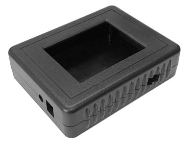

During final assembly, check the alignment and clearance as you lower the top case onto the bottom cover.

Examine the audio jack's opening. You will probably need to clean up a little extra plastic from the top cover for the round jack.

If the display is not quite centered in the opening, loosen the PCB screws and adjust its location slightly to line up correctly.

If there's a gap between the display and the top cover, use nylon #6 washers under the PCB to raise the interior assembly and close the gap. 

<h3>16.d 3D printed cover</h3>

We designed a 3D printed top cover to fit the Polycase bottom half. The STL design file is available on request so you can print and decorate your own. Here's an example of a 3D printed cover in "gold" PLA.  
 

We recommend 3D printing with PETG or ABS (instead of PLA) for improved durability and UV resistance.

<h3>Step 17: Speaker</h3>

You can connect a small 8-ohm or 4-ohm speaker either to the stereo plugin jack or to the screw terminal strip.

Note the speaker *plug* must be a standard stereo connector. The correct plug is included in the kit. Do not use a mono plug: it will result in muted or very low volume. This kit only generates a single audio channel which is connected to both sides of the stereo jack.

If you insert a speaker plug into the jack, it will automatically disconnect the speaker, if any, connected to the 4-terminal strip. Actually, it can be handy to jam in a plug to quickly silence the wired speaker during testing.

A good audio quality speaker is the Adafruit [part number 3351](https://www.adafruit.com/product/3351). This has sufficient volume to fill a car and overcome road noise. 

This speaker can be glued to the back of the Griduino case. Gluing this with the "paper cone out" offers the most volume for noisy vehicles but puts the fragile speaker cone at risk.

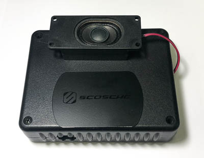

Gluing or screwing this with the paper cone *in* toward the case will protect it from damage. The speaker has a small port vent and one end to let sound out. It's not as loud in this orientation but has proven to be sufficiently clear and audible. 

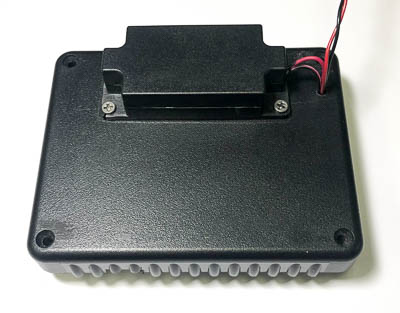

Note that additional clarity (less distortion) at high audio volume is available when powering the Griduino from a car’s electrical system with 10-15 vdc, compared to powering it from the 5v USB connector. The higher voltage source reduces clipping at higher volume levels. At lower volume levels, the speaker sounds the same regardless of power source.

<h2>5. Before You Use It</h2>

Snap a coin cell battery (3-volt CR1220 lithium) into the battery holder. Flat side is positive (+) and faces up.

Plug in the display board, checking the pin alignment on all four corners. **Important:** The display's ribbon connector must go to the right. Connecting it in the wrong orientation will damage the display or the on-board power supply.

You should now have a completed Griduino GPS kit. **Congratulations!**</style>

Before you connect power, make a detailed visual inspection under a magnifier and good light. Look for *un*soldered pads and fix them. Look for possible solder bridges that may have formed between adjacent pads. Remove any surplus solder or solder bridges with desoldering braid.

A visual check is **very important** because short circuits or solder bridges can damage the power supply, the battery, the TFT display or the Feather M4. **If that happens, it is your responsibility as the builder of the board.** It is better to have to rework or desolder something than to damage it. 

Visually check that the display is correctly plugged in to its two sockets. Look for isolated pins at each end that are not engaged in the socket. If it is accidentally mis-aligned onto the wrong pins, the power supply circuit is likely to be damaged. (Don't ask us how we know.)

<h2>6. First Power Up</h2>

Connect a micro-USB cable to the Feather M4 Express connector. If this is a factory-fresh Feather, you should see:

* Backlight turns on for the display
* Yellow LED flashes rapidly
* NeoPixel LED flashes green once per second (or the Blinky program will flash the red LED)
* No text or graphics is shown on the display
* No audio is produced by the speaker

<h2>7. Programming the Griduino GPS</h2>

You can download the latest pre-compiled binary image from GitHub. To load the Griduino programming onto your device, please see the documentation: 

https://github.com/barry-ha/Griduino

The [docs/PROGRAMMING.md](https://github.com/barry-ha/Griduino/blob/master/docs/PROGRAMMING.md) file has complete programming instructions. 

The Griduino hardware platform offers a great deal of capability with a bright colorful display, powerful cpu, GPS receiver, barometric sensor, and a digital audio channel. We hope you invent fun and useful new things for it to do.

You may find the [examples](https://github.com/barry-ha/Griduino/tree/master/examples) folder interesting and useful. It contains a variety of smaller programs that were used to develop certain concepts and check out features. For example, the barograph display can be a handy desktop application, showing a few days of barometric pressure history.

<h2>8. Using the Griduino GPS</h2>

The [docs/USERS_GUIDE.md](https://github.com/barry-ha/Griduino/blob/master/docs/USERS_GUIDE.md) file has complete information about using and configuring your Griduino.

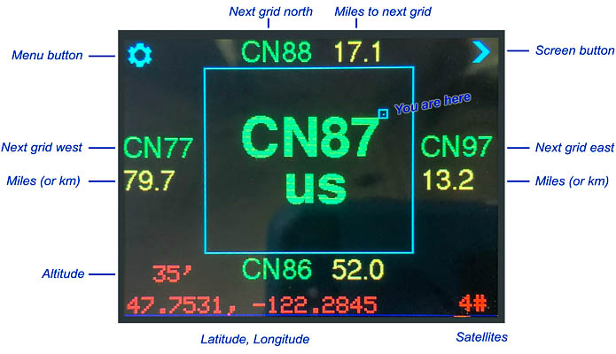

When you cross a grid line, the new grid is announced in Morse Code on the speaker.

After loading and running the Griduino program, 

* Touch the "settings" area in the upper left to advance from one configuration screen to the next.
* Touch the "next view" area in the upper right to advance from one view to the next.
* Touch the bottom half of the screen to adjust brightness.

When you arrive at a destination, you may find it useful to switch over to the GMT clock view.

Sometimes, you may find it interesting to switch over to the graphing barometer view.

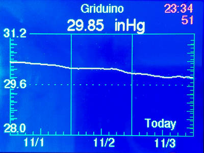

<h2>9. Disclaimer</h2>

The information provided is for general education and entertainment. We hope you learn from this and enjoy your hobbies in a safe manner with this new GPS information available at a glance. We take no responsibility for your assembly and construction, nor for how you use this device and information.

**Do not adjust Griduino while driving**. Keep your full attention on the road and the traffic around you. We can not be held responsible for any damage of any sort associated with these projects. You are advised to check your local laws and consult professionals for any project involving electricity, assembly or mounting accessories in your vehicle.

Many areas restrict where and how you are allowed to mount items around your dashboard. You are advised to drive in a safe and legal manner, consistent with all local laws, safety rules and good common sense.

You must accept that you and you alone are responsible for the safety of yourself and others in all aspects of driving with and using a Griduino.
