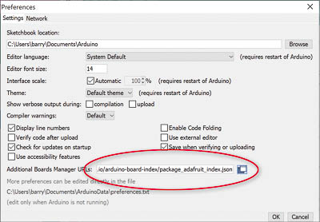

<h1>Griduino Programming Instructions</h1>

<h2>1. Introduction</h2>

Thank you for purchasing a Griduino GPS navigation kit. After [assembling the kit](https://github.com/barry-ha/Griduino/blob/master/ASSEMBLY.md "ASSEMBLY.md"), use this document to program it with the latest Griduino software. 

You can install a pre-compiled binary Griduino program, or set up the Arduino IDE (integrated development environment) to compile the source code yourself. By using the IDE, you can compile our example programs or modify the Griduino program or write all new software.

Griduino is open-source: https://github.com/barry-ha/Griduino

When complete, you'll have a useful driver's aid dedicated to show your location in the Maidenhead grid square system, your altitude, the exact time in GMT, barometric pressure and more.

<h2>2. How to Install the Griduino Program</h2>
Follow these steps to obtain the Griduino binary file and update the hardware.

1. **Download Griduino Binary** 
   - Visit https://github.com/barry-ha/Griduino
   - Click on **downloads/griduino_v018.uf2** or later version. This will open a new web page for the binary UF2 file.
   - Click on the **Download** link. Save this file where you can easily find it for the next step.

1. **Plug in Griduino** 
   - Remove the cover from Griduino to expose the Feather's "reset" button. 
   - Use a standard USB cable to connect your Griduino hardware to your computer. 
   - Depending on your computer, you should see some message about "setting up device" and possibly "device Feather M4 is ready". 

1. **Open Feather as a Drive** 
   - Press the Feather's "reset" button twice, about a half second apart.
   - The Griduino screen will blank out, and most Windows computers will sound an audible "drive ready" chime.
   - In Windows, open the File Explorer.
   - Find the new drive, e.g. "**FEATHERBOOT (F:)**"

1. **Install Griduino Software on Feather M4 Express** 
   - Drag the .UF2 file that you downloaded and drop it on the new drive. Or you can copy/paste it on the new drive.
   - The Griduino screen will blank and it will begin running the new software.
   - First it shows an animation, then it shows a credits screen with the program name and version number.
   - Tap the top half of the display to advance to the Settings screen. This includes the version number and compiled date on the bottom line.

<h2>3. How to Create a Binary File for Distribution</h2>

It may be useful to know how to create a binary image of a compiled program for Arduino processors in general. If you ever want to distribute an Arduino program, it is easier for your users to install your binary image than to compile the source code themselves.

This section also applies to how we prepared the Griduino software for general distribution.

1. **Launch Arduino IDE** 
Run the Arduino workbench on your computer.

1. **File > Open > Griduino.ino** 
Open the main source code file.

1. **Sketch > Export Compiled Binary** 
It will compile; wait for this to finish.

1. **Sketch > Show Sketch Folder** 
You will find a binary file in the sketch folder with **.bin** extension,  e.g. “Griduino.ino.feather_m4.bin”. This is the compiled binary file but it cannot be directly distributed or installed onto an Arduino board.

1. **Convert Compiled Binary to UF2** 
Run the Python conversion script (author https://github.com/microsoft/uf2): 
   - Open command line window
   - Change directory to the .bin file, e.g.: **cd C:\Users\barry\Documents\Arduino\Griduino**
   - Run the Python converter script, e.g.: **py uf2conv.py -c -b 0x4000 -o downloads/griduino.uf2 Griduino.ino.feather_m4.bin**
   - Where "**-c:**" will pass remaining arguments to python script, "**-b 0x4000**" will set start of program, "**-o file.uf2**" is output file, and "**file.bin**" is input file

<h2>4. How to Setup the Arduino IDE for Griduino</h2>

If you want to compile Griduino source code or work with its example files (and we hope you do) then here's everything you need to setup the workbench.

1. **Download and Run Arduino IDE** 
The Arduino IDE (integrated development environment) is the main workbench for writing, compiling and testing Arduino programs. 
<ul>
<li>Visit www.arduino.cc and find the **Software Downloads** section.</li>
<li>Scroll down to the **Download the Arduino IDE** section.</li>
<li>Find and **run the installer** for your operating system. For Windows, it is normal for it to open the Microsoft Store and download over 200 MB. Follow the prompts to install the software.</li>
<li>**Launch the Arduino IDE**.</li>
</ul>
As of 10-29-2020, the latest workbench version is Arduino IDE v1.8.13 

1. **Add Feather board support to Arduino IDE** 
The IDE can't find the list of SAMD boards unless we add a URL to preferences:
<ul>
<li>File > Preferences</li>
<li>Find the "Additional Boards Manager URLs" section 
</li>
<li>Add: https://adafruit.github.io/arduino-board-index/package_adafruit_index.json</li>
<li>Click OK</li>
</ul> 

1. **Install Board Support** 
In this step, we will install support files needed by Arduino IDE to talk to the Feather M4. Here's how: 
In the Arduino IDE menu bar, go to **Tools > Board > Boards Manager**. It will display a long list of hardware. Install the latest version of:
<ul>
<li>Arduino AVR Boards, Built-In by Arduino: v1.8.3</li>
<li>Arduino SAMD Boards (32-bits ARM Cortex-M0+): v1.8.8</li>
<li>Adafruit SAMD Boards: v1.6.3</li>
</ul>

1. **Select Board** 
On the Arduino IDE menu bar, select **Tools > Board > Arduino SAMD (32-bits ARM Cortex-M0+ and Cortex-M4) > Adafruit Feather M4 Express** 
If the option is not available, please review previous step "Install Board Support".

1. **Select Port** 
You'll need to figure out your COM port for this step. Here's how: 
On Windows, run the **Device Manager** and expand the section for **Ports**. One of the items listed under Ports represents the Griduino device. It is possible for the port assignment to change from day to day, so be prepared to return to the Device Manager as needed. 
In the Arduino IDE menu bar, go to **Tools > Port** and select the COM port that was given by the Device Manager. If there was more than one port listed, try them one by one.

1. **Install Libraries** 
In the Arduino IDE menu bar, go to **Tools > Manage Libraries**. Install the latest version (and their dependencies) of these libraries:
   - AudioZero v1.1.1
   - Bridge v1.7.0
   - GSM v1.0.6
   - LiquidCrystal v1.0.7
   - SD v1.2.4
   - TFT v1.0.6
   - Adafruit BMP3XX Library v1.1.0  (do not use BMP3XX v2.0.0, Adafruit made incompatible changes as a result of October 2020 driver updates from Bosch sensor software)
   - Adafruit GFX Library v1.10.1
   - Adafruit GPS Library v1.5.2
   - Adafruit ILI9341 v1.5.6
   - Adafruit ImageReader Library v2.4.0
   - Adafruit NeoPixel v1.6.0
   - Adafruit SPIFlash v3.3.0
   - Adafruit TouchScreen v1.1.0
   - elapsedMillis by Paul Stoffregen v1.0.6
   - SdFat – Adafruit Fork by Bill Greiman v1.2.3
   - Time by Michael Margolis v1.6.0

The volume control component is outside of Arduino's Library Manager, so follow this link to GitHub and install the latest version:

   - https://github.com/tom-dudman/DS1804 - library for DS1804 Digital Potentiometer

<h2>5. Disclaimer</h2>

The information provided is for general education and entertainment. We hope you learn from this and enjoy your hobbies in a safe manner with this new GPS information available at a glance. We take no responsibility for your assembly and construction, nor for how you use these devices. 

**Do not adjust Griduino while driving**. Keep your full attention on the road and the traffic around you. We can not be held responsible for any property or medical damages caused by these projects. You are advised to check your local laws and consult professionals for any project involving electricity, construction or assembly. You are advised to drive in a safe and legal manner, consistent with all local laws, safety rules and good common sense.

You must accept that you and you alone are responsible for your safety and safety of others in any endeavor in which you engage.
