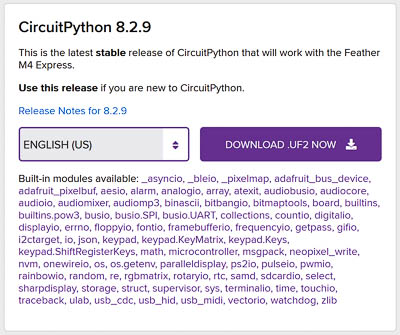

<h1>Griduino Programming Instructions</h1>

<h2 id="intro">1. Introduction</h2>

Thank you for purchasing a Griduino GPS navigation kit. After [assembling the kit](https://github.com/barry-ha/Griduino/blob/master/ASSEMBLY.md "ASSEMBLY.md"), use this document to program it with the latest Griduino software. 

You can install a pre-compiled binary Griduino program, or set up the Arduino IDE (integrated development environment) to compile the source code yourself. By using the IDE, you can compile our example programs or modify the Griduino program or write all new software.

Griduino is open-source: https://github.com/barry-ha/Griduino

When complete, you'll have a useful driver's aid dedicated to show your location in the Maidenhead grid square system, your altitude, the exact time in GMT, barometric pressure and more.

<h2 id="program">2. Install the Griduino Program</h2>
Follow these steps to obtain the Griduino binary file and update the software.

1. **Download Griduino Binary** 
   - Visit https://github.com/barry-ha/Griduino
   - Click on **downloads/griduino_v031.uf2** or later version. This will open a new web page for the binary UF2 file.
   - Click on the **Download** link. Save this file where you can easily find it for the next step.

1. **Plug in Griduino** 
   - Use a standard USB cable to connect your Griduino hardware to your computer.
   - Depending on your computer, you should see a message about "setting up device" and possibly "device Feather M4 is ready". 
   - Get a wooden (must not be metal or conductive) toothpick that can fit in the hole in the front cover. Or remove the cover to expose the "reset" button.

1. **Open Feather as a Drive** 
   - Press the Feather's "reset" button **twice**, about a half second apart.
   - The Griduino screen will blank out, and most Windows computers will sound an audible "drive ready" chime.
   - In Windows, open the **File Explorer**.
   - Find the new drive, e.g. "**FEATHERBOOT (F:)**"

1. **Install Griduino Software on Feather M4 Express** 
   - Drag the .UF2 file that you downloaded and drop it on the new drive. Or you can copy/paste it on the new drive.
   - The Griduino screen will blank and it will begin running the new software.
   - First it shows an animation, then it shows a credits screen with the program name and version number.
   - Tap the top half of the display to advance to the Settings screen. This includes the version number and compiled date on the bottom line.

<h2 id="audio">3. Install Audio Files</h2>

Griduino can use speech to announce grid lines. To do so, we must install audio recordings of the letters and numbers. These WAV files are copied onto the Feather separately using a different process than the binary program file. 

You only need to install audio files one time. 

The idea here is to temporarily install CircuitPython which allows the Flash memory to appear as an external USB drive. Then copy our "audio" folder to Flash and install the Griduino program again. The first time CircuitPython is installed, it automatically formats Flash memory in a way that remains compatible thereafter.

1. **Download "griduino_audio.zip" file from GitHub** 
   - Visit https://github.com/barry-ha/Griduino/tree/master/downloads
   - Get a copy of **griduino_audio.zip** 
   - If you want to make your own recordings that are compatible with Griduino, see the README document at https://github.com/barry-ha/Audio_QSPI.
   
1. **Unzip "griduino_audio.zip"**
   - Extract this file to a temporary folder. 
   - The result will have a folder named "audio" that contains 26 letters and 10 numbers as short recordings in standard Microsoft WAV format. 

1. **Download "CircuitPython" binary distribution file** 
   - Get the latest CircuitPython UF2 file for your board (Feather M4 Express) from https://circuitpython.org/downloads.
   - As of April 2021, the latest version is 6.1.0 and the UF2 file is named "adafruit-circuitpython-feather\_m4\_express-en_US-6.1.0.uf2" 

1. **Start the bootloader on the Feather board** by double-clicking its Reset button. 
   - After a moment, you should see a "FEATHERBOOT" drive appear on your desktop computer. 

1. **Drag the circuitpython UF2 file** from Windows to FEATHERBOOT.
   - 
   - The UF2 file will be copied and the Feather will reboot.
   - Then you should see a CIRCUITPY drive appear as an external USB drive. It will already have a few files on it. 

1. **Drag the audio folder** from Windows to CIRCUITPY. 
   - Be sure to store all of the WAV files (there are at least 36 of them) in a top-level folder named "audio".
   - Note that file names and folders are case-sensitive. 

1. **Reboot Feather and re-install Griduino** 
   - Follow the steps (above) in [2. How to Install the Griduino Program](#program) above to run the program.
   
1. **Test Griduino's audio playback** 
   - Start the Griduino program
   - Press the "gear" icon until you see the **Audio Type** screen. Select **Spoken Word**. It should immediately announce your grid square. If it beeps, then Griduino did not find the audio files.
   - Press the "gear" icon until you see the **Speaker Volume** screen. Press the up/down buttons to adjust a comfortable volume. It should play an audio sample on each press.
   - To troubleshoot errors, open the **Arduino IDE** and click **Tools** > **Serial Monitor** to read error messages.

<h2 id="uf2">4. How to Create a Binary File for Distribution</h2>

It may be useful to know how to create a binary image of a compiled program for Arduino processors in general. If you ever want to distribute your own Arduino program, it is easier for your users to install your binary image than to compile the source code themselves.

This section also applies to how we prepared the Griduino software for general distribution.

1. **Launch Arduino IDE** 
Run the Arduino workbench on your computer.

1. **File > Open > Griduino.ino** 
Open the main source code file.

1. **Sketch > Export Compiled Binary** 
It will compile; wait for this to finish.

1. **Sketch > Show Sketch Folder** 
You will find a binary file in the sketch folder with **.bin** extension,  e.g. “Griduino.ino.feather_m4.bin”. This is the compiled binary file but it cannot be directly distributed or installed onto an Arduino board.

1. **Convert Compiled Binary to UF2** 
Run the Python conversion script (author https://github.com/microsoft/uf2):
   - Open command line window
   - Change directory to the .bin file, e.g.: **cd C:\Users\barry\Documents\Arduino\Griduino**
   - Run the Python converter script, e.g.: **py uf2conv.py -c -b 0x4000 -o downloads/griduino.uf2 Griduino.ino.feather_m4.bin**
   - Where "**-c:**" will pass remaining arguments to python script, "**-b 0x4000**" will set start of program, "**-o file.uf2**" is output file, and "**file.bin**" is input file

<h2 id="ide">5. How to Setup the Arduino IDE for Griduino</h2>

If you want to compile Griduino source code or work with its example files (and we hope you do) then here's everything you need to setup the workbench.

1. **Download and Run Arduino IDE** 
The Arduino IDE (integrated development environment) is the main workbench for writing, compiling and testing Arduino programs. As of October 2020, the latest version is Arduino IDE v1.8.13 
<ul>
<li>Visit www.arduino.cc and find the **Software Downloads** section.</li>
<li>Scroll down to the **Download the Arduino IDE** section.</li>
<li>Find and **run the installer** for your operating system. For Windows, it is normal for it to open the Microsoft Store and download over 200 MB. Follow the prompts to install the software.</li>
<li>**Launch the Arduino IDE**.</li>
</ul>

1. **Add Packages Link to Board Manager** 
The IDE can't find the list of SAMD boards unless we add their magic URL to preferences:
<ul>
<li>**File** > **Preferences**</li>
<li>Find the "Additional Boards Manager URLs" section </li>
<li>To the right is an icon that when selected will open up a window to add the new URL.</li>
<li>If the below URL is not visible or a different one is showing, add the following URL using the icon to be able to see the file "Adafruit SAMD Boards v 1.6.3" in the next step.
</li>
<li>Add: https://adafruit.github.io/arduino-board-index/package_adafruit_index.json</li>
<li>It's important to use the icon because if you just type the above in to the URL slot, and select OK it will not store the new URL and be empty when you check it again.</li>
<li>Click OK</li>
</ul> 

1. **Install Board Support** 
In this step, we will install support files needed by Arduino IDE to talk to the Feather M4. Here's how: 
In the Arduino IDE menu bar, go to **Tools > Board > Boards Manager**. It will display a long list of hardware. Install the latest version of:
<ul>
<li>Arduino AVR Boards, Built-In by Arduino: v1.8.3</li>
<li>Arduino SAMD Boards (32-bits ARM Cortex-M0+): v1.8.11</li>
<li>Adafruit SAMD Boards: v1.6.6</li>
</ul>

1. **Select Board** 
On the Arduino IDE menu bar, select **Tools > Board > Arduino SAMD (32-bits ARM Cortex-M0+ and Cortex-M4) > Adafruit Feather M4 Express** 
If the option is not available, please review previous step "Install Board Support".

1. **Select Port** 
You'll need to figure out your COM port for this step. Here's how: 
On Windows, run the **Device Manager** and expand the section for **Ports**. One of the items listed under Ports represents the Griduino device. It is possible for the port assignment to change from day to day, so be prepared to return to the Device Manager as needed. 
In the Arduino IDE menu bar, go to **Tools > Port** and select the COM port that was given by the Device Manager. If there was more than one port listed, try them one by one.

1. **Install Libraries** 
In the Arduino IDE menu bar, go to **Tools > Manage Libraries**. Install the latest version (and their dependencies) of these libraries:
   - AudioZero v1.1.1
   - SD v1.2.4
   - TFT v1.0.6
   - Adafruit BMP3XX Library v2.0.2
   - Adafruit GFX Library v1.10.7
   - Adafruit GPS Library v1.5.4
   - Adafruit ILI9341 v1.5.6
   - Adafruit ImageReader Library v2.6.1
   - Adafruit NeoPixel v1.8.0
   - Adafruit SPIFlash v3.3.6
   - Adafruit TouchScreen v1.1.1
   - elapsedMillis by Paul Stoffregen v1.0.6
   - SdFat – Adafruit Fork by Bill Greiman v1.2.3  *Note:* Use v1, as we have not tested v2  *Note:* There are two libraries with similar names. Be sure to install "SdFat - Adafruit Fork" and not "SdFat" which has an incompatible SdFat.h file
   - Time by Michael Margolis v1.6.0  *Note:* searching the library manager for the word "time" lists just about every library. Searching for the word "timekeeping" will show the correct library.

These components are outside of Arduino's Library Manager, so follow these links to GitHub and install the latest version:

   - https://github.com/tom-dudman/DS1804 v0.1.1 - library to control DS1804 Digital Potentiometer
   - https://github.com/barry-ha/Audio_QSPI v1.1.0 - library to play WAV files from Quad-SPI memory chip

<h2 id=disclaimer>6. Disclaimer</h2>

The information provided is for general education and entertainment. We hope you learn from this and enjoy your hobbies in a safe manner with this new GPS information available at a glance. We take no responsibility for your assembly and construction, nor for how you use these devices. 

**Do not adjust Griduino while driving**. Keep your full attention on the road and the traffic around you. We can not be held responsible for any property or medical damages caused by these projects. You are advised to check your local laws and consult professionals for any project involving electricity, construction or assembly. You are advised to drive in a safe and legal manner, consistent with all local laws, safety rules and good common sense.

You must accept that you and you alone are responsible for your safety and safety of others in any endeavor in which you engage.
