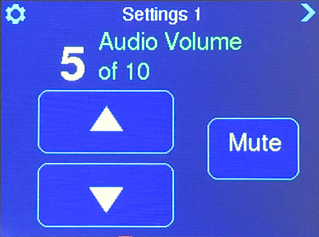
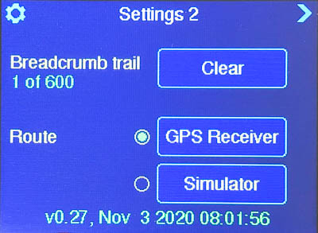
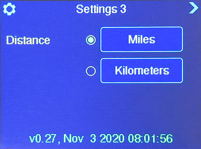
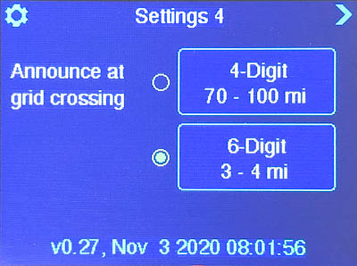
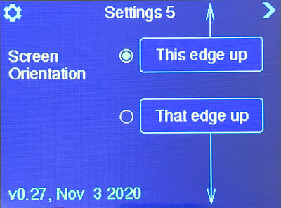

# Griduino User's Guide

This guide applies to Version 1.0 and above.

# 1. Introduction

Thank you for purchasing a Griduino GPS navigation kit. Once assembled, this kit is a useful driver's aid dedicated to show your location in the Maidenhead grid square system, your altitude, the exact time in GMT, barometric pressure and more.

This guide contains: 

* <a href ="#Quick_Start_Guide">Quick Start Guide</a> tells you how to read the main grid display. 
* <a href="#Screen_Reference_Guide">Screen Reference Guide</a> provides detail about everything it can display.

If you like to write software, the hardware is a highly capable platform for programming your own features. The Griduino software is open source and it includes several smaller example programs.

# 2. Quick Start Guide

This example image shows a westbound trip on Hwy 20 driving from Eastern Washington State over the Cascade Mountains toward Seattle:

* Large blue rectangle represents your current Maidenhead grid square
* Small blue rectangle represents your current position
* Curved blue line shows your breadcrumb trail to reach your current position
* Grid names are in green
* Grid distances are in yellow
* Bottom row is the latitude and longitude in decimal degrees
* Bottom right is the number of GPS satellites received, e.g.  __7#__
* Bottom right is the height above sea level, e.g.  __204'__

Things you can do:

* Press the **Gear icon** in upper left to advance among the settings screen
* Press the **Arrow icon** in upper right to advance among the information screens
* Press the **bottom row** to change the screen's brightness

When you cross a grid line, the new grid is announced with Morse Code on the speaker.

When you arrive at a destination, you might want to switch to the GMT clock view. This is useful to visually compare to your computer clock for accurate time.

Griduino has non-volatile memory to save its settings, the breadcrumb trail, barometer readings, and more while it is turned off.

Optional connectors:

* Connect headphones or speaker to hear audio. [Here's how.](https://github.com/barry-ha/Griduino/blob/master/docs/ASSEMBLY.md#speaker "Speaker")
* Connect a battery or vehicle power. [Here's how.](https://github.com/barry-ha/Griduino/blob/master/docs/ASSEMBLY.md#power "Power")

# 2. Screen Reference Guide
Griduino will automatically show a few screens in sequence as it powers up. During this time, it does not respond to touches or anything else.

### 2.1 Power-up animation (one time only)
Griduino shows a simple animation while waiting for a serial monitor port. This allows it time to connect to your computer's serial monitor via a USB connection.

### 2.2 Credit screen (one time only)
Griduino will briefly show the author's name and program version number. This is an easy way to know what software is loaded. Later, in the settings screens, it show the version number again along with date it was compiled.

### 2.3 Help screen (one time only)
Griduino shows a brief reminder of the touch-sensitive areas on the main grid display. Although the later screens include small gear and arrow icons, you may note their touch-sensitive areas really cover most of the screen. Accuracy is not required for a busy driver.

# 3. User Screens
After loading and running the Griduino program,  

* Touch the "settings" gear in the upper left to advance from one configuration screen to the next.
* Touch the "next view" arrow in the upper right to advance from one view to the next.
* Touch the bottom third of the screen to adjust brightness. There are three backlight levels.

### 3.1 Grid location view
Griduino has non-volatile storage to save your breadcrumb trail (driving track) from one day to the next. 

### 3.2 Grid details view

### 3.3 GMT clock view

# 4. Configuration Screens
To cycle among the various configuration screens, repeatedly press the "gear" icon.

To return to the main display screens, press the "next screen" arrow in the upper right.

### 4.1 Select audio volume

### 4.2. Select GPS or Demo Mode
To start a demonstration mode, Griduino can simulate travel. Bring up the **Settings 2** view. Change the Route to **Simulator** and return to the main grid view. It follows a pre-programmed route to show the breadcrumb trail and what happens at grid crossings. There are a few different routes available, selectable at compile-time. The most interesting and the default canned route will drive at 900 mph in a big ellipse near the edges of one grid square. 

To cancel the GPS demonstration, reboot Griduino. Or you can return to **Settings 2** and select **GPS Receiver**.

*Delete img/view-settings-img7050.jpg*

### 4.3 Select English or Metric
Although this says "miles" and "kilometers", it actually changes all reported units of all types to English or Metric. That is, the barometric pressure will be shown in "inHg" or "hPa".

### 4.4 Select Audible Announcement Boundaries
You can choose between audible announcements at 4-digit grid boundaries or 6-digit boundaries. Typically:

* 6-meter rovers are interested in distances to the next major grids.
* Microwave rovers often use distance scoring based on 6-digit grid lines and are interested in the next minor boundary. 

When you press one of these buttons, Griduino will play an audible sample of the announcement.

The main grid display continues to show the 4-digit grid. This selection only controls when announcements are made.

### 4.5 Screen Orientation
You can use Griduino in either one of two landscape orientations. This allows you to place its connectors on either side for ease of installing this on your desk or in your vehicle.

# 5. Commands in Terminal Session

In version 1.07 or later, you can open a terminal session to Griduino, such as the Serial Monitor in the Arduino IDE. Type a command and Griduino will respond in this interactive window. 

## help

The **help** command will list all supported commands:

    10:06:08.730 -> help: Available commands are:
    10:06:08.730 -> help, version, dump kml, dump gps, list, start nmea, stop nmea, start gmt, stop gmt

## version

The **version** command will report build information:

    10:06:11.636 -> version: Griduino v1.07
    10:06:11.636 -> Compiled Feb 28 2022 10:04:39
    10:06:11.636 -> Barry K7BWH  John KM7O
    10:06:11.636 -> C:\Users\barry\Documents\Arduino\Griduino\Griduino.ino
    10:06:11.636 -> https://github.com/barry-ha/Griduino

## dump kml

**dump kml** command will list all the recorded GPS readings in text that is compatible with KML (keyhole markup language) for Google Earth and other mapping programs. This is intended for the Griduino Desktop program; to use it independently you can copy/paste this into a text file. For example:

    10:13:19.195 -> dump kml: <?xml version="1.0" encoding="UTF-8"?>
    10:13:19.195 -> <kml xmlns="http://www.opengis.net/kml/2.2" xmlns:gx="http://www.google.com/kml/ext/2.2" xmlns:kml="http://www.opengis.net/kml/2.2" xmlns:atom="http://www.w3.org/2005/Atom">
    10:13:19.195 -> <Document>
    10:13:19.195 -> 	<name>Griduino Track</name>
    10:13:19.195 -> 	
    10:13:19.195 -> 	<StyleMap id="gstyle0">
    10:13:19.195 -> 		<Pair>
    10:13:19.195 -> 			<key>normal</key>
    10:13:19.195 -> 			<styleUrl>#gstyle1</styleUrl>
    10:13:19.195 -> 		</Pair>
    10:13:19.195 -> 		<Pair>
    10:13:19.195 -> 			<key>highlight</key>
    10:13:19.195 -> 			<styleUrl>#gstyle</styleUrl>
    10:13:19.195 -> 		</Pair>
    10:13:19.195 -> 	</StyleMap>
    10:13:19.195 -> 	
    10:13:19.195 -> 	<Placemark>
    10:13:19.195 -> 		<name>Griduino Track</name>
    10:13:19.195 -> 		<styleUrl>#gstyle0</styleUrl>
    10:13:19.195 -> 		<LineString>
    10:13:19.195 -> 			<tessellate>1</tessellate>
    10:13:19.195 -> 			<coordinates>
    10:13:19.195 -> -122.2844,47.7530,0 
    10:13:19.195 -> 			</coordinates>
    10:13:19.195 -> 		</LineString>
    10:13:19.195 -> 	</Placemark>
    10:13:19.195 -> 	<Placemark>
    10:13:19.195 -> 		<name>Start 02/28/22</name>
    10:13:19.195 -> 		<styleUrl>#m_ylw-pushpin0</styleUrl>
    10:13:19.195 -> 		<Point>
    10:13:19.195 -> 			<gx:drawOrder>1</gx:drawOrder>
    10:13:19.195 -> 			<coordinates>-122.2844,47.7530,0</coordinates>
    10:13:19.195 -> 		</Point>
    10:13:19.195 -> 	</Placemark>
    10:13:19.195 -> </Document>
    10:13:19.195 -> </kml>

## start nmea

The **start nmea** and  **stop nmea** commands will echo raw NMEA sentences to the console. This is intended for the Griduino Desktop program. For example:

    10:17:33.996 -> start nmea: started
    10:17:34.463 -> $GPRMC,181734.000,A,4745.1831,N,12217.0822,W,0.28,31.44,280222,,,A*42
    10:17:35.397 -> $GPRMC,181735.000,A,4745.1831,N,12217.0822,W,0.43,340.55,280222,,,A*7B
    10:17:36.510 -> $GPRMC,181736.000,A,4745.1832,N,12217.0823,W,0.14,298.75,280222,,,A*7E
    10:17:37.491 -> $GPRMC,181737.000,A,4745.1833,N,12217.0823,W,0.47,81.89,280222,,,A*41
    10:17:38.465 -> $GPRMC,181738.000,A,4745.1833,N,12217.0821,W,0.36,93.99,280222,,,A*48

## start gmt

The **start gmt** and **stop gmt** commands will echo the Griduino RTC (real time clock) to the console. It's pretty busy; the console will receive updates every clock tick on the second. This is intended for the Griduino Desktop program. For example:

    10:18:59.871 -> start gmt: started
    10:19:00.271 -> 2022-02-28 18:18:59+00:00
    10:19:01.250 -> 2022-02-28 18:19:00+00:00
    10:19:02.276 -> 2022-02-28 18:19:01+00:00
    10:19:03.272 -> 2022-02-28 18:19:02+00:00

## list

The **list** command will report SDRAM usage. This is mainly for debugging file problems, such as when the 2 MB file system is nearly full:

    10:06:12.937 -> list: 
    10:06:12.937 -> Directory of Griduino
    10:06:12.937 ->          100 screen.cfg
    10:06:12.937 ->          100 volume.cfg
    10:06:12.937 ->           97 announce.cfg
    10:06:12.937 ->         6240 barometr.dat
    10:06:12.937 ->        19416 gpsmodel.cfg
    10:06:12.937 ->         1240 ten_mile.cfg
    10:06:12.937 ->          100 barogrph.cfg
    10:06:12.937 ->            7 Files, 27293 bytes
    10:06:12.937 -> 
    10:06:12.937 -> Directory of audio
    10:06:12.937 ->        34916 _LICENSE.md
    10:06:12.937 ->         1542 _README.md
    10:06:12.937 ->        20552 0.wav
    10:06:12.937 ->        15860 1.wav
    10:06:12.937 ->        15874 2.wav
    (snip)
    10:06:12.937 ->        24140 x.wav
    10:06:12.937 ->        22964 y.wav
    10:06:12.937 ->        22732 z.wav
    10:06:12.937 ->           38 Files, 804870 bytes

# 6. Programming the Griduino GPS

You can find, download and install the latest Griduino program using the latest documentation on GitHub: 

https://github.com/barry-ha/Griduino

For hobbyists interested in a deep dive, [docs/PROGRAMMING.md](https://github.com/barry-ha/Griduino/blob/master/docs/PROGRAMMING.md) has complete Arduino IDE setup and programming instructions. 

# 7. Files Saved in RAM

Griduino uses the 2 MB Quad SPI RAM chip built onto the Feather M4 board to save its configuration settings (such as audio volume and distance units) and its data logging files (such as GPS track and barometer history).

**View:** There are a few ways to view the Griduino's RAM file system.

1. Run the Griduino main program and, using the serial monitor, type "list" and press Enter.
1. Run CircuitPython and use Windows file system to examine external drive named ``CIRCUITPY``
1. Run our example program: ``Flash_file_directory_list``

Our example program shows a few files on the display and sends the complete file listing to the serial monitor. It will re-send the listing periodically. A typical output from this program (May 2022) is:

	Listing files in the root directory:
	1. System Volume Information  (dir)
		 IndexerVolumeGuid  76
		 WPSettings.dat     12
	2. .fseventsd      (dir)
	3. code.py         22
	4. boot_out.txt    117
	5. data.txt        70
	6. Griduino        (dir)
		 screen.cfg      100
		 volume.cfg      100
		 announce.cfg    97
		 barometr.dat    6240
		 ten_mile.cfg    1240
		 altimetr.cfg    100
		 gpsmodel.cfg    38632
	7. main.py         0
	8. audio           (dir)
		 _LICENSE.md     34916
		 _README.md      1542
		 0.wav           20552
		 1.wav           15860
		 2.wav           15874
		 3.wav           16108
	     ...

**Modify:** To edit or delete file in the 2 MB Quad SPI RAM chip, run CircuitPython and use your Windows file system to manage the files on the external drive named ``CIRCUITPY``.

# 8. Support

Please browse our public group forum at [groups.io/g/Griduino/](https://groups.io/g/Griduino/)

Join our group to hear about upgrades, new software, ask questions, share your experience and suggest features.

# 9. Disclaimer

The information provided is for general education and entertainment. We hope you learn from this and enjoy your hobbies in a safe manner with all this new and interesting GPS information available at a glance. We take no responsibility for your assembly and construction, nor for how you use these devices. 

**Do not adjust Griduino while driving**. Keep your full attention on the road and the traffic around you. We can not be held responsible for any property or medical damages caused by these projects. You are advised to consult professionals for any project involving electricity, construction or assembly. You are advised to check local regulation for allowable methods of mounting and using dashboard devices. You are advised to drive in a safe and legal manner, consistent with all local laws, safety rules and good common sense.

You must accept that you and you alone are responsible for your safety and safety of others in all aspects of working with Griduino.
