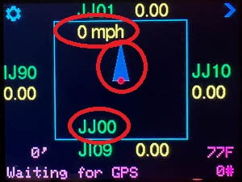

# Changelog

To install a firmware update, see the [Programming](https://github.com/barry-ha/Griduino/blob/master/docs/PROGRAMMING.md#2-how-to-install-the-griduino-program) instructions.

All notable changes to this project are documented in this file.

Version numbers correspond to [Downloads](https://github.com/barry-ha/Griduino/tree/master/downloads) available as pre-compiled binary Griduino programs.

The changelog format is based on [Keep a Changelog](https://keepachangelog.com/en/1.0.0/), and the Griduino project uses [Semantic Versioning](https://semver.org/spec/v2.0.0.html).

## v1.15 beta &nbsp; 2025-06-22

Version 1.15 is a beta release to consolidate enhancements since the last stable release of v1.10 on 2022-08-05. Read the changelog features below to find more new features.

New: an additional main grid display shows vehicle speed and a large bright pointer of direction. The breadcrumb trail will paint over the status while you drive. The large 6-digit grid letters are smaller to make room for the compass. The compass is derived from GPS readings; when you're stopped at 0 mph, you can expect the compass to wander around.

New: Griduino runs correctly on both PCB v4 and the latest PCB v14 hardware 

New: Configurator screens are resequenced to put the most commonly used options first.

New: GPS Simulator rewritten and now generates speed for the compass+speedometer display. Note it will show 2,000-3,000 mph which is the real ground speed required to traverse the big oval track that it generates.

New: example/TFT_Triangle_Demo.ino sketch shows the simplest possible "speed+compass" for performance testing 

New: auto detect barometric sensor SPI or I2C hardware

Fixed: coin battery voltage is only shown on PCB hardware that has a voltage sensor (PCB v12 and later)

Issue: no spoken word audio

Issue: barometric pressure "Baroduino" screen will plot three days of air pressure readings in real time but it does not save history when turned off

## v1.14.4 alpha &nbsp; 2024-12-20

Version 1.14.4 is an Alpha release, bringing enhancements and fixes over the last twelve months that were made while preparing new hardware.

New: "Reformat Flash Memory" screen can recover from corrupted flash memory situations

New: major new general-purpose debug logging system is configurable by subsystem and severity

New: Coin Battery measurement, bar graph, low battery warning, and logging (new hardware only)

New: moved Help screen into main loop, now it's just another view of many views

New: "dir" command, synonymous with "list files"

New: added example NeoPixel program, the simplest possible thing that can work

## v1.13.2 beta &nbsp; 2024-01-04

Version 1.13.2 is a Beta release.

Fixed: Laggard "one second" screen refresh which occurred only every 47 seconds.

Fixed: Satellite reception bar graph in inverted mode; history increased to ten minutes.

Removed: Speech announcements temporarily disabled until a lockup condition is fixed.

## v1.13 alpha &nbsp; 2023-11-30

Version 1.13 is an Alpha release. This is a snapshot of current development as we freeze the RPi 2040 development. Now that Adafruit has started shipping the Feather M4 Express again, we shelved the rp2040 PCB project.

New: Added a bar graph history of satellite reception for the last 8 minutes.

Fixed: Task scheduling is more reliable, although a lockup condition is still possible after several days of continuous operation.

## v1.12 beta &nbsp; 2023-05-17

Version 1.12 is a Beta release containing significant changes. Please report any problems, thank you.

New: If GPS satellite signal is lost, make an audible announcement every 5 minutes. This is often enough to tell the driver without distracting them too much.

New: Re-wrote entire breadcrumb trail and 'dump kml' function.

New: Internal history now keeps track of more information: speed, direction, altitude, and number of satellites. All these are available in 'dump kml' and can be displayed in Google Earth and other KML-compatible programs.

New: Breadcrumb trail now records are "power up" and "first valid time from GPS receiver". This will help diagnose situations where GPS reception is spotty.

New: Automatically records GPS position every 10 minutes to keep track of being parked in one spot for awhile.

New: Animated logo on opening screen.

New: Support for a new microprocessor: RP2040. Since the Adafruit Feather M4 is no longer obtainable, we've put considerable effort over the last six months for the replacement CPU and a new PCB. On eventual release, we can recompile this source code for either processor.

Fixed: The main display screen no longer bogs down when the breadcrumb trail has more than 1,500 items. This would also cause slow GPS sync and loss of GPS signal because it failed to poll the GPS chip often enough.

## v1.10 &nbsp; 2022-08-05

New: Supports the "GPS Status" panel of NMEATime2, showing the satellite signal strength and sky location of GPS satellites.

## v1.09 beta &nbsp; 2022-06-21

Fixed: Hang on Hint screen (If this has any problems, please run v1.06 instead.)

New: Doubled the size of the GPS bread crumb trail. It'll retain about 1,500 miles of GPS history before overwriting the oldest spot in its circular buffer.

New: Griduino can automatically and continually update your computer's time of day. It requires you to install NMEATime2, available from www.visualgps.com and is free for 30 days then purchased for about $20. Please try it out and send me comments about this beta test.

## v1.08 &nbsp; 2022-06-07

Not Quite Fixed: A rare condition in some Griduinos running v1.07 causes it to hang on the startup Hint screen. This doesn't happen often, but if starts then it will always hang during boot. The problem tends to occur after driving for some distance, perhaps about a hundred miles.

Version 1.08 is not recommended for any users.

## v1.07 &nbsp; 2022-02-28

New: Added terminal session commands. Now you can open a terminal session to Griduino, such as the Serial Monitor in the Arduino IDE. Type a command and Griduino will respond. 

**help** - list all supported commands:

    10:06:08.730 -> help: Available commands are:
    10:06:08.730 -> help, version, dump kml, dump gps, list, start nmea, stop nmea, start gmt, stop gmt

**version** - report build information:

    10:06:11.636 -> version: Griduino v1.07
    10:06:11.636 -> Compiled Feb 28 2022 10:04:39
    10:06:11.636 -> Barry K7BWH  John KM7O
    10:06:11.636 -> C:\Users\barry\Documents\Arduino\Griduino\Griduino.ino
    10:06:11.636 -> https://github.com/barry-ha/Griduino

**dump kml** - list all the recorded GPS readings in text that is compatible with KML (keyhole markup language) for Google Earth and other mapping programs. This is intended for the Griduino Desktop program; to use it independently you can copy/paste this into a text file. For example:

    10:13:19.195 -> dump kml: <?xml version="1.0" encoding="UTF-8"?>
    10:13:19.195 -> <kml xmlns="http://www.opengis.net/kml/2.2" xmlns:gx="http://www.google.com/kml/ext/2.2" xmlns:kml="http://www.opengis.net/kml/2.2" xmlns:atom="http://www.w3.org/2005/Atom">
    10:13:19.195 -> <Document>
    10:13:19.195 -> 	<name>Griduino Track</name>
    10:13:19.195 -> 	
    10:13:19.195 -> 	<StyleMap id="gstyle0">
    10:13:19.195 -> 		<Pair>
    10:13:19.195 -> 			<key>normal</key>
    10:13:19.195 -> 			<styleUrl>#gstyle1</styleUrl>
    10:13:19.195 -> 		</Pair>
    10:13:19.195 -> 		<Pair>
    10:13:19.195 -> 			<key>highlight</key>
    10:13:19.195 -> 			<styleUrl>#gstyle</styleUrl>
    10:13:19.195 -> 		</Pair>
    10:13:19.195 -> 	</StyleMap>
    10:13:19.195 -> 	
    10:13:19.195 -> 	<Placemark>
    10:13:19.195 -> 		<name>Griduino Track</name>
    10:13:19.195 -> 		<styleUrl>#gstyle0</styleUrl>
    10:13:19.195 -> 		<LineString>
    10:13:19.195 -> 			<tessellate>1</tessellate>
    10:13:19.195 -> 			<coordinates>
    10:13:19.195 -> -122.2844,47.7530,0 
    10:13:19.195 -> 			</coordinates>
    10:13:19.195 -> 		</LineString>
    10:13:19.195 -> 	</Placemark>
    10:13:19.195 -> 	<Placemark>
    10:13:19.195 -> 		<name>Start 02/28/22</name>
    10:13:19.195 -> 		<styleUrl>#m_ylw-pushpin0</styleUrl>
    10:13:19.195 -> 		<Point>
    10:13:19.195 -> 			<gx:drawOrder>1</gx:drawOrder>
    10:13:19.195 -> 			<coordinates>-122.2844,47.7530,0</coordinates>
    10:13:19.195 -> 		</Point>
    10:13:19.195 -> 	</Placemark>
    10:13:19.195 -> </Document>
    10:13:19.195 -> </kml>

**start nmea** and  **stop nmea** - echo raw NMEA sentences to the console. This is intended for the Griduino Desktop program and for NMEATime2 by www.visualgps.com. For example:

    10:17:33.996 -> start nmea: started
    10:17:34.463 -> $GPRMC,181734.000,A,4745.1831,N,12217.0822,W,0.28,31.44,280222,,,A*42
    10:17:35.397 -> $GPRMC,181735.000,A,4745.1831,N,12217.0822,W,0.43,340.55,280222,,,A*7B
    10:17:36.510 -> $GPRMC,181736.000,A,4745.1832,N,12217.0823,W,0.14,298.75,280222,,,A*7E
    10:17:37.491 -> $GPRMC,181737.000,A,4745.1833,N,12217.0823,W,0.47,81.89,280222,,,A*41
    10:17:38.465 -> $GPRMC,181738.000,A,4745.1833,N,12217.0821,W,0.36,93.99,280222,,,A*48

**start gmt** and **stop gmt** - echo the Griduino RTC (real time clock) to the console. This is intended for the Griduino Desktop program. For example:

    10:18:59.871 -> start gmt: started
    10:19:00.271 -> 2022-02-28 18:18:59+00:00
    10:19:01.250 -> 2022-02-28 18:19:00+00:00
    10:19:02.276 -> 2022-02-28 18:19:01+00:00
    10:19:03.272 -> 2022-02-28 18:19:02+00:00

**list** - report SDRAM usage. This is mainly for debugging file problems, such as when the 2 MB file system is nearly full:

    10:06:12.937 -> list: 
    10:06:12.937 -> Directory of Griduino
    10:06:12.937 ->          100 screen.cfg
    10:06:12.937 ->          100 volume.cfg
    10:06:12.937 ->           97 announce.cfg
    10:06:12.937 ->         6240 barometr.dat
    10:06:12.937 ->          280 gpsmodel.cfg
    10:06:12.937 ->         1421 gpshistory.csv
    10:06:12.937 ->         1240 ten_mile.cfg
    10:06:12.937 ->          100 barogrph.cfg
    10:06:12.937 ->            7 Files, 27293 bytes
    10:06:12.937 -> 
    10:06:12.937 -> Directory of audio
    10:06:12.937 ->        34916 _LICENSE.md
    10:06:12.937 ->         1542 _README.md
    10:06:12.937 ->        20552 0.wav
    10:06:12.937 ->        15860 1.wav
    10:06:12.937 ->        15874 2.wav
    (snip)
    10:06:12.937 ->        24140 x.wav
    10:06:12.937 ->        22964 y.wav
    10:06:12.937 ->        22732 z.wav
    10:06:12.937 ->           38 Files, 804870 bytes

**Scottish Voice** &nbsp; 2020-02-22

New: Added Scottish female voice speaking NATO alphabet for grid-crossing.

You can install this by over-writing restarting Griduino in "Circuit Python" mode, so that it will become an external USB-attached file system. In this mode you can drag-n-drop the "audio" folder and overwrite the previous "audio" folder with the new voice files. Read the complete instructions in the **doc** folder section **3. Install Audio Files**.

## v1.06 &nbsp; 2021-10-11

New: Added the "internal case temperature" to the main screen display in the lower right corner, right above the number-of-satellites-received indicator. This will help people in hot climates recognize if Griduino running too hot (above 150F).

New: Opening animation shows colorful starbursts instead of the green time tunnel, just for fun.

## v1.05 &nbsp; 2021-08-07

Fix: The "set" button on the Ten Mile Alert screen did not always save the location.

New: The Ten-Mile Alert screen is slightly changed to highlight "Here" and improve visual focus.

## v1.04 &nbsp; 2021-07-21

New: Ten Mile Alert screen for microwave rovers. This lets you set a pushpin at your current location and then report straight-line distance and direction while you drive around. It's designed for ARRL microwave contests that require moving at least ten miles (16 km) before contacting the same station again.

Fix: Now it will remember your local timezone through a power cycle.

## v1.03 &nbsp; 2021-07-10

Fixed the visual layout when the screen is rotated. This affected the Altimeter display and the Countdown to Date screens which were badly mangled.

## v1.02 &nbsp; 2021-06-24

New: The "count-down to date" view can cycle among five different events: ARRL June VHF Contest, Groundhogs Day, Christmas, Halloween, and Valentine's Day. Look for a "More" button on the right edge of the screen. This was a major revision to view_date.h module.

## v1.01 &nbsp; 2021-04-26

New: Replaced the status screen with new "Grid Size and Scale" information.

This gives the user a sense of scale looking at our main screen map. It helps understand the bread crumb trail and how far to go within a 4-digit and 6-digit grid squares. The previous status screen was one of the first screens built and became redundant with other screens.

## v1.0 &nbsp; 2021-04-17

Griduino has all major features completed, so the version number jumps to **v1.0**. We like the [semantic versioning](https://semver.org/) scheme so we'll manage our version numbers accordingly. However, since Griduino doesn't have an API, our scheme is  modified to only use two numbers.

Given a version number `MAJOR.MINOR`, we will increment the:

   * `MAJOR` version when adding major features or hardware changes, and
   * `MINOR` version for fixing bugs or for small incremental changes.

## v0.37 &nbsp; 2021-04-12

Added speech audio output as an alternative to Morse code. This is a major upgrade.

Griduino can now speak grid square names. This feature requires:

   1. Install audio recordings of the letters and numbers. These WAV files are copied onto the Feather separately using a different process than the binary program file. See https://github.com/barry-ha/Griduino/blob/master/docs/PROGRAMMING.md#3-install-audio-files
   1. Install the latest Griduino program, v0.37 or later
   1. Press the "gear" icon until you see the **Audio Type** screen. Select **Spoken Word**. It should immediately announce your grid square. If it beeps, then Griduino did not find the audio files.

## v0.36 &nbsp; Skipped

This was an internal testing version. The pre-compiled binary was not released.

## v0.35 &nbsp; 2021-02-25

Fixed several bugs in the Altimeter view. Added a small 'sync' button on right-hand side which calibrates the sea level pressure so that the two reported altitudes match each other. The GPS is not always right but it's pretty close and the 'sync' button will make large adjustments easy.

Also fixed the three-day graph of barometric pressure. It had been graphing only two days and now it will show up to three full days.

Get this download and try it out! Recommended for all users.

## v0.34 &nbsp; 2021-02-11

Improved the Altimeter view usability. This is a work in progress.

## v0.33 &nbsp; 2021-02-09

Added Altimeter view which compares altitude from the barometer to altitude from the GPS. This is an interesting way to cross-check and decide for yourself the accuracy of reports.

The problem is that both of them can be off:

* An accurate reading from the barometer depends on knowing your current pressure at sea level at your location. The altimeter screen therefore offers + and - buttons to calibrate it. You can get the correct pressure by searching the web for a local weather report, or by adjusting it to a known altitude.
* An accurate reading from the GPS depends on the number and position of satellites overhead. You would need a good satellite right overhead for best results. Further, signal reflections from nearby objects can throw it off. Unfortunately the consumer GPS service was designed to be more accurate positionally than for altitude. For example, at my home, the GPS reports can vary day-by-day by 300 feet or so.

## v0.32 &nbsp; 2021-02-03

Added 3-day graph of barometric pressure, a "Baroduino" if you'll excuse the amalgam. Please report any bugs or usability glitches.

This is a major update that merges code from [examples/Baroduino](https://github.com/barry-ha/Griduino/tree/master/examples/Baroduino) into the main Griduino program which becomes an additional view in the screens as you cycle through views. The standalone example program is no longer needed. We also fixed a few bugs and changed titles of the configuration screens to be more descriptive, such as "1. Speaker" instead of "Settings 1".

## v0.31 &nbsp; 2021-01-30

Updated the pressure sensor code to use the latest BMP3XX library. Please update to the v2 library from Adafruit or you’ll get a compile error:
1 Run the Arduino workbench
1 Tools > Manage Libraries … > Type: Updatable
1 Find “Adafruit BMP3XX Library” in the list and update to the latest version
1 It’s okay to get all the latest library dependencies, too. The list has been updated and tested for v0.31.

When we started the Griduino project in early 2020, Adafruit offered only one barometric sensor: BMP388. In October 2020, Bosch introduced a more sensitive device, BMP390, and Adafruit followed suit to sell it on a pin-compatible breakout board. However, it’s not quite software-compatible. I bought and tested the new BMP390 to make sure it works successfully and today I checked in the code changes. Griduino software will now work with either barometric sensor and is a little more future-proof.

## v0.30 &nbsp; 2020-12-19

Fixed the background color of the activity indicator on the bottom line. The code change was to extend the base class in view.h so that every screen is allowed to have its own background color independent of other screens.

## v0.29 &nbsp; 2020-11-26

Created new example program to study TFT Resistive Touchscreen behavior and calibration. See [examples/TFT Touch Calibrator](https://github.com/barry-ha/Griduino/tree/master/examples/TFT_Touch_Calibrator). The idea is to display the touchscreen configuration values along with values actually measured when you actually touch it. The screen feedback shows how where each touch is mapped into screen coordinates. There is a certain amount of manufacturing variability and it's possible that my values don't suite your own device. If your particular touchscreen looks too far off, it reports the measured values which you can use to edit your source code and compile/run again.

## v0.28 &nbsp; 2020-11-12

In the graphing barometer, added "number of satellites" and today's date. Also added debug output for the serial-attached console to help track down if the RTC hangs up.

## v0.27 &nbsp; 2020-11-03

Added new feature to select how often grid-crossing announcements are made. You can choose either 4-digit grid lines (about 70 miles N-S and 100 miles E-W) or 6-digit grid lines (about 3 miles N-S and 4 miles E-W). The setting is implemented as a new 'view' in cfg_setting4.h and is retained in non-volatile RAM.

##  v0.26 &nbsp; 2020-10-29

Added data logger for barometric pressure into the main Griduino program. Now it collects the weather history in the background while doing everything else.  Then, to display the pressure graph, download baroduino_v026.uf2.

## v0.25 &nbsp; 2020-10-03

Improved timing to make the GMT clock more closely match WWV.

Before this change, it typically displayed 'xx:59' seconds as the tone is heard.  But sometimes the 'xx:58' is displayed, and sometimes it skips the 'xx:59'  display and goes directly to the :00 seconds exactly on the 1 second 'tick'.

## v0.24 &nbsp; 2020-10-02

Added new view for a frivolous "Groundhog Day" counter display. We feel like we're stuck in a time loop, just like Bill Murray in his 1993 movie. Now we know how long we've been in the pandemic and self-imposed social distancing.

Also vastly updated the standalone "Baroduino" example program.

## v0.23 &nbsp; 2020-09-02

Refactored views into base class "View" and derived classes. No visible change to usage and operation.

## v0.22 &nbsp; 2020-08-23

Added setting to show distance in miles/kilometers

## v0.21 &nbsp; 2020-08-20

Fixed audio volume set-save-restore bug

## v0.20 &nbsp; 2020-08-14

Added icons for gear, arrow

## v0.18 &nbsp; 2020-07-06

Added runtime selection of GPS receiver vs simulated trail

## v0.17 &nbsp; 2020-06-23

Added Settings control panel, and clear breadcrumb trail

## v0.16 &nbsp; 2020-06-03

Added GMT Clock view

## v0.15 &nbsp; 2020-05-30

Added simulated GPS track (class MockModel)

## v0.13 &nbsp; 2020-05-12

Implemented our own TouchScreen functions

## v0.12 &nbsp; 2020-05-09

Refactored screen writing to class TextField

## v0.11] &nbsp; 2020-05-21

Added GPS save/restore to visually power up in the same place as previous spot

## v0.10 &nbsp; 2020-04-19

Added altimeter example program

## v09.8 &nbsp; 2020-02-18  

Added saving settings in 2MB RAM

## v09.4 &nbsp; 2020-02-18

Added a new view for controlling audio volume

## v09.3 &nbsp; 2020-01-01  

Made the Morse Code actually work, and replaces view-stat-screen

## v09.2 &nbsp; 2019-12-30  

Added Morse Code announcements via generated audio waveform on DAC.

## v09.0 &nbsp; 2019-12-20  

Generates sound by synthesized sine wave intended for decent fidelity from a small speaker. The hardware goal is to support spoken-word output.
